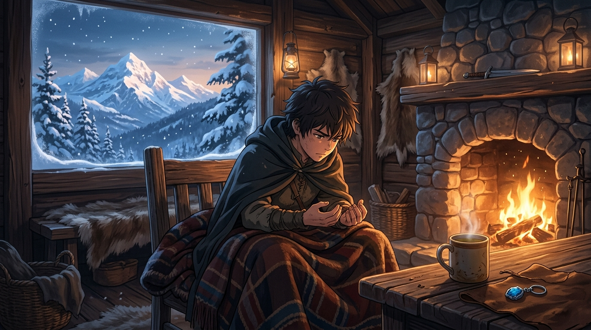

# 🖼️ 爐火前的退場算式 (The Withdrawal Calculation beside the Hearth)

### 創作理念與感悟

本作品取材自奇幻史詩《刺客正傳 2：皇家刺客》（`book-farseer-trilogy_02`）序曲〈夢與蘇醒〉。

第一集結尾斐滋在頡昂佩歷經毒殺、嚴刑拷打、差點淹死，拼死保全了惟真的王位與群山王國的盟約；但第二集的開頭，羅蘋·荷布沒有給予英雄凱旋的光環，而是把最赤裸、最痛苦的代價擺在桌面上——一個才十五歲的少年，身體已經像老頭一樣顫抖、痙攣、連舀一勺麥片粥都拿不穩。

畫面捕捉了木屋內極致的冷暖對比：窗外是群山王國覆雪的萬丈冷峰，屋內是噼啪作響的石砌壁爐。斐滋裹著羊毛毯，凝視著自己不聽使喚的手掌。桌上靜靜放著駿騎留下的藍石銀網耳環，那是博瑞屈誓死追隨的信物，也是他無法擺脫的血統重擔。

「如果我還相信自己是個正常人，就會回去，但我已經不是了，博瑞屈。我成了別人的某種義務了，好比棋局中需要受保護的棋子，或是任人宰割的人質，毫無能力自衛和保護別人。不，身為吾王子民，我只能趕在別人加害於我，並且藉此傷害國王之前趕快離開這個棋局。」

承認自己的殘破不是自暴自棄，而是極致清醒的止損。當自己成為棋盤上的負資產、會讓保護他的人露出身後空檔時，主動離開棋盤不是逃避，而是對誓言最痛苦的忠誠。

