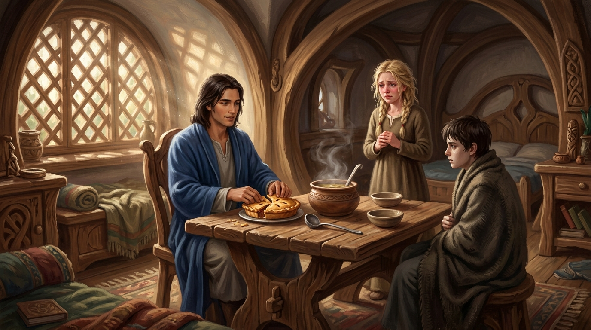

# 🖼️ 三等分的蘋果派與王者的坦蕩

這幅畫取自《刺客正傳》（`book-farseer-trilogy_01`）第二十一章〈王子〉。

在經歷了驚心動魄的劇毒「帶我走」之夜後，拂曉的微光穿透頡昂佩生長之城的木雕花窗。盧睿史（Rurisk）王子穿著寬鬆的睡袍衝入房間，手裡拿著瀉藥；在確認蜚滋安然無恙後，他沒有掩飾家醜，而是勒令衝動護兄、哭紅了雙眼的珂翠肯公主端來熱肉湯與剛出爐的蘋果派。

在裊裊升騰的白霧與誘人香氣中，盧睿史親手將蘋果派掰成三等分。他毫不猶豫地大口喝下熱湯、吃下蜚滋挑選的第一塊派餅，再將第二塊交給妹妹，第三塊留給虛弱披毯的少年刺客。當著刺客的面吃下同一盤食物——盧睿史用這份毫無保留的王者坦蕩，當場粉碎了兩國陣營間緊繃的猜忌與殺機。

更令人動容的是盧睿史的公僕胸懷。他深知群山王國土地有限、人口日增，必須通商換取糧食與放牧權；他更主動承諾砍伐群山筆直高大的白橡木，提供給惟真建造抵禦紅船劫匪的戰船。他那句「**海洋是一條通往四面八方的康莊大道，你們的海岸則是我們走上大道的途徑**」，跨越了時空與陣營，與駿騎王子的遠見靈魂共鳴。

生長之城的木樓裡沒有高牆，而王者的胸襟正是比任何石牆都更堅不可摧的真正屏障！a~ 🦈🏔️🥧✨

