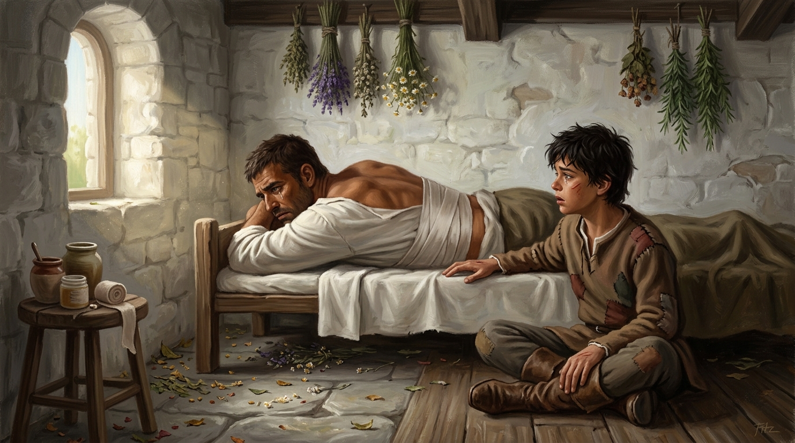

# 🖼️ 醫務室的放逐與未落之淚

這幅畫取自《刺客正傳》（book-farseer-trilogy_01）第十七章〈考驗〉。在蓋倫惡意設局的精技測驗中，蜚滋被丟包在荒涼的冶鍊鎮北方。當他在夢中感應到公鹿堡馬廄遇襲、小狗鐵匠為了守護博瑞屈而身受重傷時，蜚滋毫不猶豫地拋下了精技測驗與所有的自尊，在寒夜與海堤中冒死狂奔趕回公鹿堡。

儘管鐵匠微弱的生命線在半途終究熄滅、儘管蜚滋在海堤被遭冶鍊者圍攻而身心俱疲，他依然滿身傷痕地闖進了城堡醫務室。在春日陽光照耀的窄床上，躺著胸口纏滿繃帶、臉部腫脹的博瑞屈。

少年的手緊緊握住博瑞屈的手，確認對方依然活著；然而，當博瑞屈得知鐵匠因原智牽繫戰死、蜚滋為了趕回救他而徹底放棄精技考驗時，恐懼、自責與嚴苛的守護本能化作了最沉重的爆發。博瑞屈抽回了手，轉身面壁，流下了痛苦自責的眼淚，怒斥自己辜負了駿騎的託付，並將蜚滋徹底驅逐出馬廄與自己的生命。

本小姐選擇凝結醫務室中的這一刻——溫暖明亮的春日陽光與散落一地的藥草，對比著床榻上被恐懼與自責壓垮的壯年男人，以及坐在地上滿臉茫然、失去最後依靠的十四歲少年。博瑞屈的背影既是嚴酷的放逐，也是深沉的悲劇：他以為把蜚滋推開能拯救這個孩子，卻在親手斬斷牽絆的同時，將蜚滋拋進了更無邊無際的孤獨深淵。a~ 🦈💔

