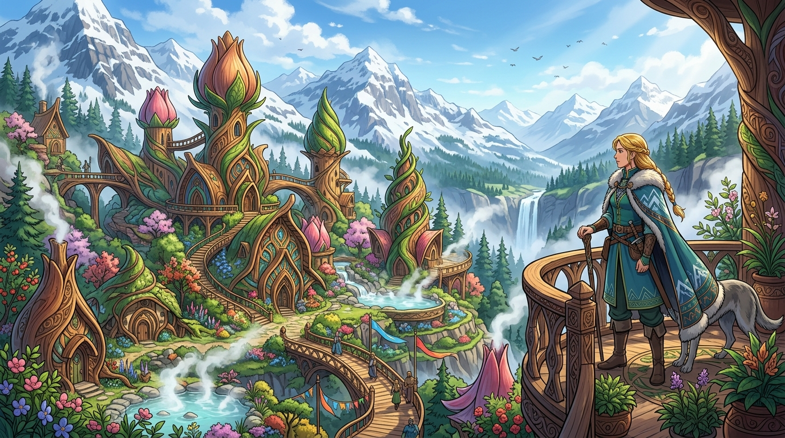

# 🖼️ 群山王國的花苞之城頡昂佩

這幅畫取自《刺客正傳》（`book-farseer-trilogy_01`）第二十章〈頡昂佩〉。

穿越法洛平原的酷熱與參天古松森林後，六大公國的迎親隊伍終於抵達群山王國的心臟——頡昂佩（Jhaampe）。眼前的壯麗景象徹底洗去了公鹿堡宮廷的陰鬱與沉重：這裡沒有冰冷灰暗的堡壘石牆，整座城市順著山勢與百年巨木的自然生長紋理，被精巧地雕琢成一座座如含苞待放花蕾般的木質樓宇，屋頂與樑柱帶著優雅舒展的藤木曲線，彩色塗漆在高原陽光下宛如盛開的花田。

地熱溫泉自雪山岩層中奔湧而出，化作穿城而過的清澈暖溪與蒸騰白霧，滋養著梯田露台上的高山繁花。而在木樓露台上，十八歲的珂翠肯（Kettricken）公主迎風獨立——金髮梳成結實的長辮，身著飾有雪山紋樣的實用保暖皮袍，神情沉靜堅定而充滿尊嚴。在她的身旁，忠誠的雪山獵犬溫順依偎，靜靜凝望著這座沒有城牆卻固若金湯的家園。

群山王國將統治者視為「犧牲獻祭（Sacrifice）」，國王與公主是人民最極致的公僕。當平地公國在高牆後為了稅收與權力爭吵不休時，這座依山而生、毫無防禦工事的木雕之城，以其不可動搖的無私信念，構築出了整片大陸上最不可攻破的心靈堡壘！a~ 🦈🏔️✨

