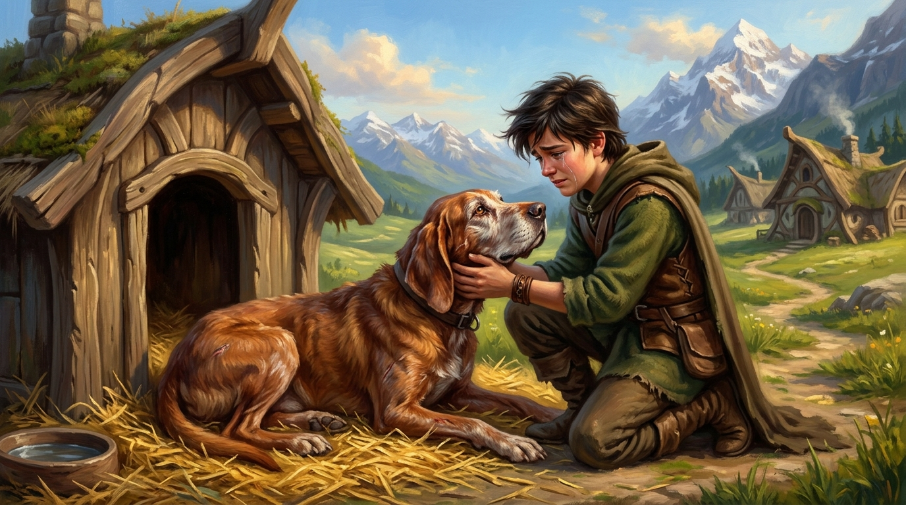

# 🖼️ 大鼻子的陽光餘生

這幅畫取自《刺客正傳》（`book-farseer-trilogy_01`）第二十一章〈王子〉。

在歡慶兩國盟約的喧囂午後，盧睿史王子帶著身心俱疲的蜚滋漫步至低矮的木造狗舍。在金黃溫暖的稻草堆上，一隻毛髮斑駁、身形老邁的紅毛獵犬在陽光下安詳打盹。聽到主人的呼喚，牠緩緩站起，銅礦色的溫暖眼眸中倒映出少年刺客的身影——那是「大鼻子」（Nosy）！

那是蜚滋幼年時第一隻以原智（Wit）靈魂相通、卻在某個殘酷夜晚被強行奪走的小狗。十幾年來，蜚滋一直認定是嚴厲冷酷的博瑞屈將牠殘忍敲碎頭顱、割斷喉嚨處死，這個血腥夢魘夜夜啃噬著少年的心靈。然而在群山王國純淨的晴空下，真相大白：博瑞屈當年並未痛下殺手，而是悄悄託付漫遊文書，將牠萬里迢迢送給了熱愛獵犬的盧睿史，讓牠在雪山與陽光中度過了受盡寵愛與尊重的幸福一生。

當蜚滋單膝跪在陽光草地上，顫抖的手指撫摸著老獵犬粗糙溫暖的毛皮，那股久違的原智牽繫如同一道溫柔的金色陽光穿透積雪，瞬間融化了十幾年來深埋心底的仇恨、恐懼與冰冷創傷。

儘管隨後與博瑞屈的對質揭示了兩人價值觀永不妥協的悲哀天塹，但至少在這一刻，在群山王國的暖陽下，生命的光芒勝過了所有的嚴刑峻法，童年的詛咒終於被愛與真實溫柔打破。a~ 🦈🐾🏔️✨

