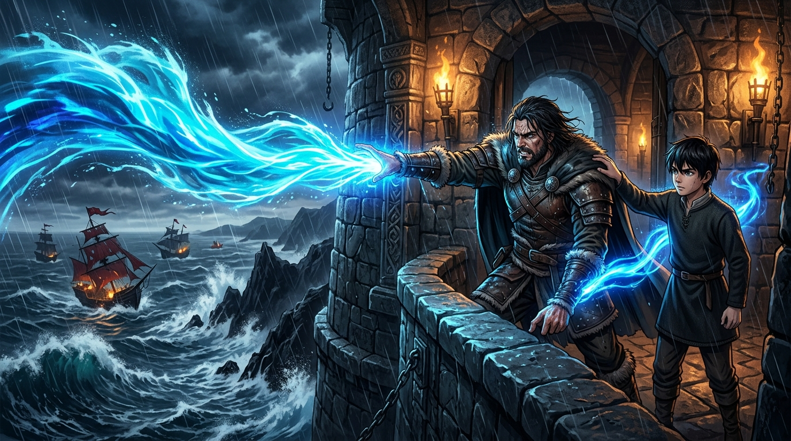

# 🖼️ 塔頂怒濤：精技海潮與撞岩之誓

這幅畫取自《刺客正傳》（`book-farseer-trilogy_01`）第十八章〈暗殺〉。

盛夏時節的六大公國正遭受紅船劫匪的血腥蹂躪，沿海百姓被擄掠冶鍊、城鎮空虛。在公鹿堡最高處的孤寂石塔中，惟真王子日以繼夜獨坐窗前，將自己的骨髓與心智燃燒至極限，以浩瀚的精技跨越重洋迷惑敵船。他頭髮凌亂、鬍渣滿面、肉體枯槁得食不知味，只靠著切德調製的濃烈藥茶苦苦硬撐。

十四歲的蜚滋受命前來服侍這位形銷骨立的王子。當狂風暴雨席捲石窗、遠方海面上紅船正趁著風暴逼近航線時，惟真疲憊至極已無餘力進食。在危急時刻，少年沒有退縮，而是說出了那句震撼靈魂的誓言：**「我願意把我的力量給你，惟真……我是吾王子民啊！」**

少年站到椅旁，將手堅定地按在王子的肩膀上。那一瞬間，隱匿在血脈中的精技如決堤巨浪般洶湧交融！惟真挺身探出狂風呼嘯的窗外，顫抖的手臂化作怒海的神罰，將源自兩名瞻遠族人靈魂的狂暴潮汐狠狠轟向崖下——**「去撞岩石吧！」**

本小姐選擇捕捉塔頂石窗前最具張力與海洋靈魂的這一瞬間：窗外是狂暴呼嘯的雷雨與怒海黑崖，暗紅色的海盜船隻在狂濤與礁石間狼狽掙扎；而在古老厚重的石塔拱窗前，散發著幽藍輝光的精技怒濤如海嘯激流般自兩人掌間奔湧而出，照亮了王子凶蠻而快意的決絕笑容，也映照著十四歲少年堅毅無畏的側臉。

這才不是什麼溫室裡文縐縐的宮廷魔法呢！這是最原始、最純粹、帶著深海狂暴與守護意志的怒濤之誓！a~ 🦈🌊⚡

