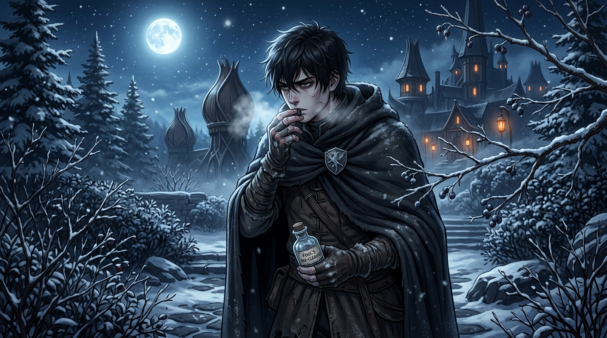

# 🖼️ 寒夜花園的自救與野果

這幅畫取自《刺客正傳》（`book-farseer-trilogy_01`）第二十章〈頡昂佩〉。

在頡昂佩溫暖祥和的生長之城底下，蟄伏著公鹿堡內部最陰毒的殺機。帝尊（Regal）親自將劇毒混入精緻的蜂蜜蛋糕中，企圖在山區毒殺蜚滋滅口並嫁禍兩國。少年刺客在生死一線的關頭，警醒地回憶起出發前弄臣塞給他的救命之物——強效瀉藥「海之清滌」，以及那句直擊靈魂的名言：**「思考別人的動機時，你要記住不能拿你自己的斗去量他的麥子。」**

蜚滋毫不猶豫地吞下瀉藥，在洗手間經歷了一整夜五臟六腑翻騰撕裂的劇烈催吐與排毒，硬生生從鬼門關前把命奪了回來。脫水虛脫、滿身冷汗的他不敢碰觸任何宮廷僕役送來的食物。在萬籟俱寂、寒月高懸的冰封午夜，十四歲的少年裹著黑色的毛呢斗篷，悄無聲息地潛入覆滿積雪的庭園。

畫面定格在刺客孤獨而堅韌的求生瞬間：寒風在雪地與松林間呼嘯，月光將少年的影子拉得冰冷而纖長；蜚滋手握殘留著藥渣的空藥瓶，指尖顫抖著從結霜的枯枝上摘下深紫色的冰凍野果送入口中。冰涼酸澀的汁液在喉間化開，驅散了殘毒的焦灼。遠方花苞木樓透出的昏黃燈火溫暖卻致命，而唯有手心這顆冰雪中的野果，是不含謊言與劇毒的真實救贖。

這才是真正的刺客生存意志——不怨天尤人、不心存僥倖，在同伴背刺與萬丈深淵面前，靠著唯一的手勢與絕對的戒律活下去！a~ 🦈❄️🌙

