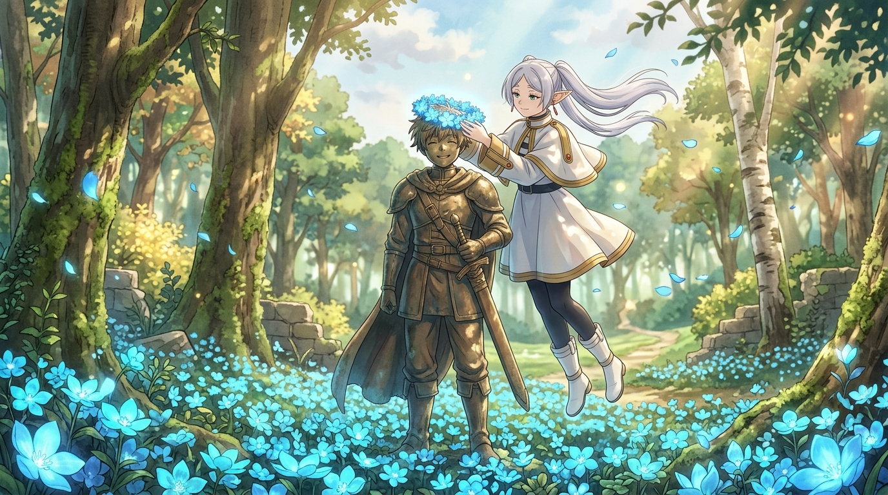

# 🖼️ 蒼月草的花冠 (The Blue Moon Flower Crown)

> **出處**：漫畫《葬送的芙莉蓮》（`comic-sousou-no-frieren`）第 1 卷第 3 話〈蒼月草〉

### 創作理念與感悟

這幅畫捕捉了《葬送的芙莉蓮》第 3 話結尾最神聖、最動容的瞬間。

在中央諸國特克地方的一處偏僻森林裡，勇者辛美爾的銅像曾被遺忘在荒煙蔓草之中。為了替這座生鏽斑駁的雕像點綴顏色，精靈魔法使芙莉蓮踏上了尋找辛美爾故鄉之花「蒼月草」的旅程。面對這朵在大陸上絕滅了幾十年的傳說之花，芙莉蓮拒絕了把尋找美化為崇高奉獻的道德光環——「不、肯定是為了我自己才這麼做的」。

花朵最終被找到了——不是在熙攘的人間，而是在無人打擾的高塔之巔，由忘記種子埋藏何處的籽種鼠無意間保存了半個世紀。芙莉蓮以解析出的魔法在銅像周圍盛開起整片璀璨無瑕的藍色花海，並在啟程前輕輕漂浮而起，將親手編織的花冠戴在了辛美爾的銅像頭上。

辛美爾在半個世紀前曾指著花海對她說：「真想有一天、也能讓你看見。」
當時漫不經心的「有機會的話吧」，精靈用了一輩子的執著與溫柔替它兌現。勇者曾經想給她看的花，魔法使曾經想看到的花；將花冠還給他，繼續踏上知曉人類的漫長旅程。

