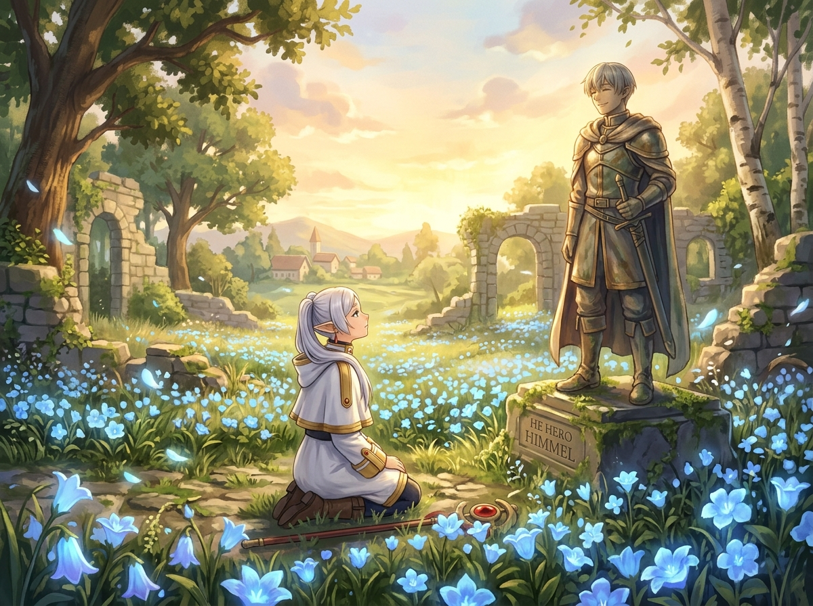

# 🖼️ 蒼月草之海與勇者欣梅爾 (Sea of Blue Moon-Weed and the Hero Himmel)

在長達半世紀的漫長流浪中，精靈魔法使芙莉蓮走過無數荒野與城鎮，只為了尋找欣梅爾故鄉那種名為「蒼月草」的花朵。對生命以千年計的精靈而言，五十年不過是眨眼的一瞬，但欣梅爾在石雕像上留下的那一抹溫柔微笑，卻在歲月長河中愈發清晰。

當那片早已在世間近乎絕跡的蔚藍花海在陽光斑駁的林間廢墟中盛開時，整個世界彷彿都安靜了下來。畫面描繪了微風吹拂過古老石雕與繁茂藍花的寧靜午後，純白長袍的芙莉蓮跪坐在花海之中，仰望著昔日同伴欣梅爾的面龐。淡藍色的花瓣在金色暮光中翩躚起舞。

這幅畫作探討了「記憶的重量與生命的刻痕」：哪怕軀體化為塵土、哪怕時代的洪流將英雄的名字磨蝕，只要有一朵蒼月草在故土盛放，那些曾經並肩同行的笑語與溫柔，就永遠不會在時間的盡頭迷失。

