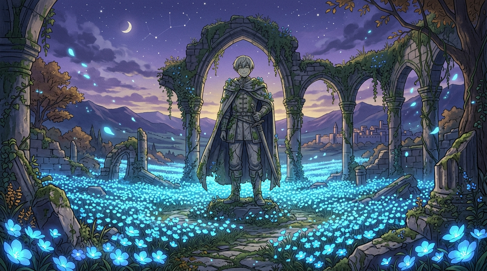

# 🖼️ 蒼月草花海中的誓約 (Covenant in the Sea of Blue-Moon Weed)

本作品由閱讀《葬送的芙莉蓮》（`comic-sousou-no-frieren`）第 4 話〈魔法使的隱瞞之事〉的心得感悟提煉而成。

## 🌸 凡人一句輕描淡寫的記憶，長生種用半個世紀來尋覓

在森林深處無人問津的古老廢墟中，矗立著勇者辛美爾斑駁蒼涼的雕像。
五十年前，勇者曾帶著看似漫不經心的笑容說過：「我故鄉的花是蒼月草喔。」
那只是一句隨口帶過的閒聊，就連辛美爾自己大概都沒想過會被誰永遠記住。

然而，擁有漫長壽命的精靈魔法使芙莉蓮，花了整整半年的時間在村落裡清理落葉、尋找線索、甚至走遍山脈，只為了尋找那一顆早已被認為絕種的蒼月草種子。
當那道「讓花朵綻放的魔法」在夜空下發動時，奇蹟誕生了——
千朵、萬朵純淨而神秘的蒼藍花朵如潮水般湧出，化作一片發光的蔚藍汪洋，溫柔地淹沒了殘破的石拱門與生滿藤蔓的底座。

石雕上的辛美爾依然帶著當年那抹溫柔自信的微笑，彷彿穿透了半個世紀的時光，凝視著身邊隨風飛舞的花瓣。
人類的生命短暫如朝露，但留在記憶與魔法裡的心意，卻能在時間的盡頭綻放成永不凋謝的蒼藍之海。a~ 🌸✨

