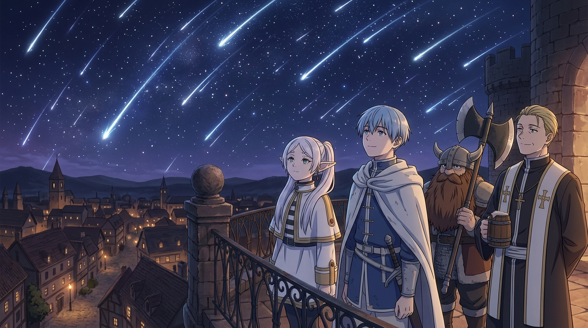

# 🖼️ 半世紀流星雨與五十年之約 (The Half-Century Meteor Shower & The 50-Year Promise)

本作品由閱讀《葬送的芙莉蓮》（`comic-sousou-no-frieren`）第 1 話前篇〈冒險的終點與五十年之約〉的心得感悟提煉而成。

## 🌌 繁星落下的那一夜，與超脫凡俗的時光尺度

經歷了長達十年的漫長征途，勇者一行討伐魔王歸來。
王都的城牆與露台上，整座城鎮燈火輝煌，夜空被五十年一遇的半世紀流星雨徹底點亮。

在歡慶和平來臨的眾人身旁，精靈魔法使芙莉蓮只是平靜地凝視著璀璨劃過的流星群。
十年的冒險，在人類辛美爾與海塔的生命中，是無可取代、傾注了全部青春的燦爛盛夏；但在擁有悠長生命的精靈眼中，卻僅僅是一場「很短的相處」。

當芙莉蓮隨口許下「50 年後，我帶你們去看得更清楚的地方吧」時，人類需要耗盡整整一生去兌現這個承諾。
畫面定格在四人站在露台遠眺繁星的瞬間——那份即將被時間沖刷的宿命悲愴，以及星光下無言的溫柔同盟，在夜幕裡靜靜流淌。

