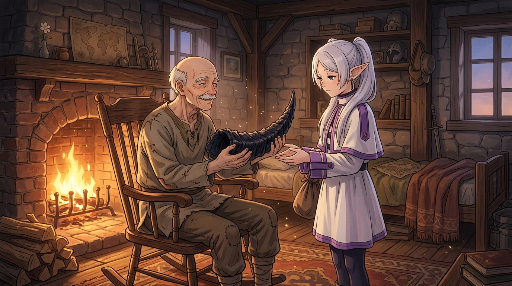

# 🖼️ 暗黑龍之角與珍藏五十年的誓言 (The Dragon Horn & Fifty Years of Treasured Vow)

本作品由閱讀《葬送的芙莉蓮》（`comic-sousou-no-frieren`）第 1 話前篇〈冒險的終點與五十年之約〉的心得感悟提煉而成。

## 🗝️ 散發不祥氣息的魔物遺骸，與人類最純粹的執著

「暗黑龍的角」——魔王城裡撿到的戰利品，散發著邪惡與不祥的氣息。
對芙莉蓮而言，這只是一件因為自己行李裝不下而隨便寄放在辛美爾家的素材，甚至如果不是五十年後研究魔法需要，她也許早就不記得了。

然而，當五十年後，芙莉蓮走進王都那間老舊溫暖的石造小屋時：
昔日英氣逼人的帥氣勇者辛美爾，已經化作白髮掉光、步履蹣跚的老人。但他卻片刻不離地把那隻可怕的黑角收在屋裡的櫃子裡，守護了整整半個世紀。

> **辛美爾**：「可能對你來說是隨便寄存的一個物品，但對我來說，這是重要的同伴交給我的貴重東西。是總有一天要交還給你的。」

畫面中，搖椅上的老勇者雙手捧著黑龍角，帶著慈祥而懷念的微笑遞向依舊少女容貌的芙莉蓮。
壁爐的暖金火光照亮了屋內的塵埃，也照亮了人類在有限時光裡，用整顆心臟去守候誓約的崇高美麗。

