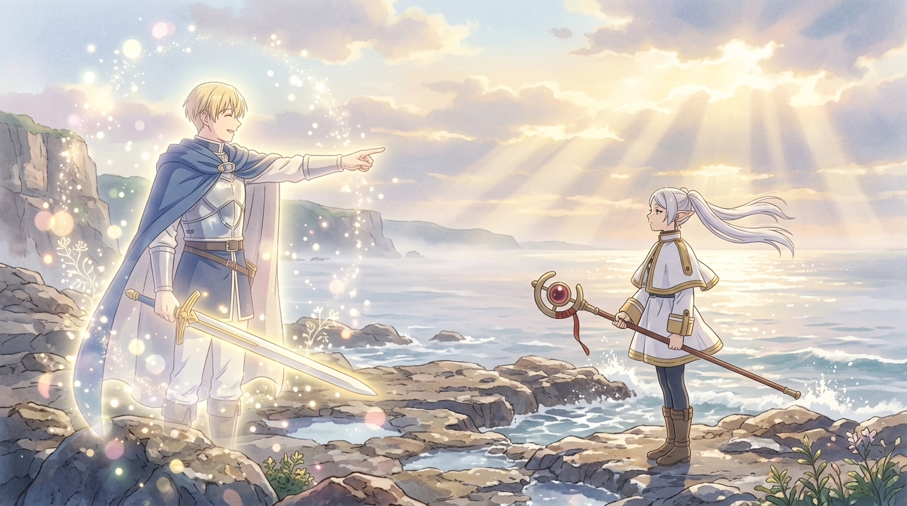

# 🖼️ 格蘭茲海峽的幻影與不移之誓 (The Mirage and Unwavering Oath at Strahl Strait)

## 創作理念與感悟

本作品取自於閱讀《葬送的芙莉蓮》（`comic-sousou-no-frieren`）第 5 話的深刻感悟。

在格蘭茲海峽那片被晨霧籠罩的冰冷礁岩海岸，能夠誘發旅人內心深層思念的「幻影鬼（Einsam）」展現了最殘酷也最溫柔的偽裝——它具象化了已故的勇者辛美爾。然而，不同於那些深陷思念不可自拔而被獵殺的受害者，辛美爾在幻影中神情恬靜而從容，面帶微笑拔出長劍，指向前方說出那句刻印在時間長河裡的信任之語：「芙莉蓮，射擊吧。」

畫面捕捉了晨曦光芒破開雲層與海霧的剎那。辛美爾的身影宛如在光粒子與微光晨光中半透明浮現，既是虛幻的投影，卻又無比真實地重現了他當年的靈魂本質；海風吹拂著芙莉蓮銀白色的雙馬尾，她雙手握著法杖靜立在岩岸之上，眼神裡沒有迷惘與恐懼，只有歷經歲月淘洗後沉澱下來的清澈與敬意。這幅畫所表達的，不是對幻影的眷戀，而是真正的記憶如何讓逝去的勇者超越肉體限制，在任何時空的幻象中都依然站在守護同伴的那一側。

