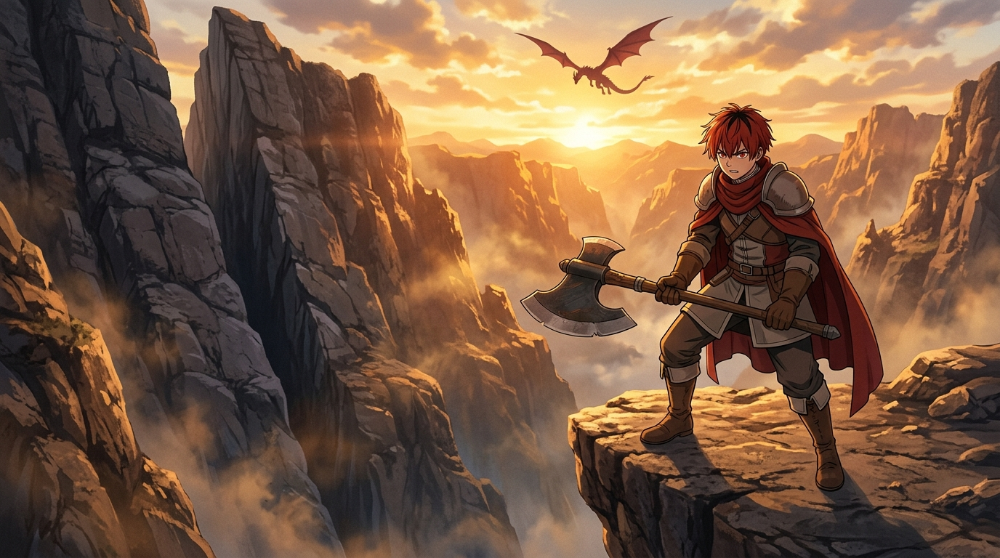

# 🖼️ 戰士的雙膝與破崖一擊 (The Warrior's Trembling Knees and Cliff-Cleaving Strike)

## 創作理念與感悟

本作品源自於閱讀《葬送的芙莉蓮》（`comic-sousou-no-frieren`）第 6 話的靈感提煉。

在荒涼險峻的龍之峽谷，盤踞著令人聞風喪膽的巨大紅鏡龍。村莊的守護者、戰士艾冉的唯一弟子修塔爾克（Stark），自稱膽小如鼠，面對巨龍時雙腿止不住地顫抖。然而正如艾冉所言：「會害怕並不是什麼可恥的事，我也曾因恐懼而顫抖過。」真正的勇氣並非毫無畏懼，而是明知恐懼卻依然站上前線、握緊兵刃。

畫面呈現了黃昏餘暉將峽谷峭壁染成一片金紅的壯烈時刻。修塔爾克披著赤色披風，手握巨大的雙手雙刃戰斧，筆直站立於突出的岩角絕壁。在他身後，是一道貫穿整座山峰、平滑如鏡的巨大垂直裂縫——那是他三年來日復一日在恐懼中全力揮斧、終究劈開懸崖的實質鐵證。遠方的天際線上，巨大的紅鏡龍在燃燒般的雲層中盤旋投下暗影，但戰士紅色的眼眸中已然燃起了覺悟的星火。顫抖的雙膝承載著恐懼，而揮出的戰斧則斬斷了退路。

