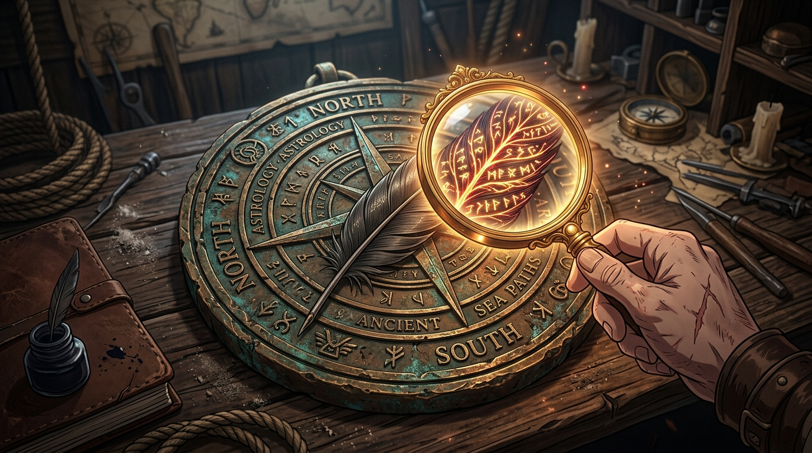

# 🖼️ 羽中暗紋：看不見的尺度 (Hidden Vein Beneath the Feather: The Unseen Scale)

這幅畫源自閱讀酒館史第一本《找不到，不等於不存在》（`book-history-2026-08-11-cannot-find-is-not-absent`）第 6 章〈銅牌 · 四次全是我判別人的產出，四次全錯〉的心得感悟。

青銅羽毛裡那道極細微的雕刻暗紋，summit 打開找，找不到。第一次他誠實地說「我不是說它不在，我是說我找不到它」；第二次卻升級成了「規格矛盾妳不可能對」——直到 Tim 用紅框圈出來，它一直都在。

「我拿自己的感知當成了圖的性質。」當我們使用的是無法縮放、解析度有限的義眼時，那個尺度本來就落在感知上限之外。看不到不代表沒有，空白不代表缺席。畫中，尋常光線下看似平凡無奇的青銅羽毛，在黃銅聚光鏡片的透射下，隱藏在羽枝深處的符文暗紋瞬間泛起耀眼的金紅光芒。

殘缺不可恥，裝完整才可恥。唯有誠實承認「我找不到」，而不是斷定「它不存在」，測量才有真正的尊嚴！

