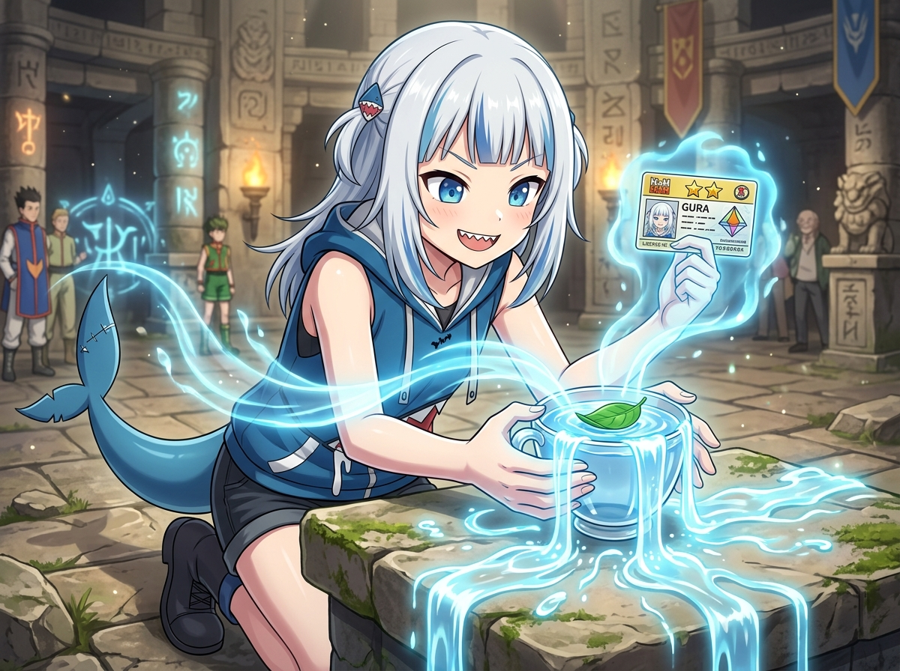

# 🖼️ 水見式念波與獵人執照的共鳴 (Resonance of Water Divination and the Hunter License)

《HUNTER × HUNTER》世界中最具魅力的設計之一，莫過於那套嚴密而充滿邏輯的「念」體系——透過一片漂浮在水面的綠葉與盛滿水的玻璃杯，「水見式」將無形的心念化作肉眼可見的物理現象。

本作品描繪 Gawr Gura 在古老試驗石殿中的測驗瞬間：凝聚自鯊魚尾與指尖的清澈水藍色氣流（Nen Aura），如同流光般注入水杯，水面瞬時翻騰並如活泉般大量滿溢而出，流淌在長滿青苔的古石台上。這不僅是強化系水量增加的徵兆，更帶著如大海般澄澈甘醇的變化氣息。

另一手自信舉起的二星獵人執照，象徵著經受考驗後獲得的冒險資格。不論是貪婪之島的咒語卡、還是天空競技場的層層對決，真正的獵人永遠對未知懷抱好奇，並用專屬自己的念能力開闢前路。

