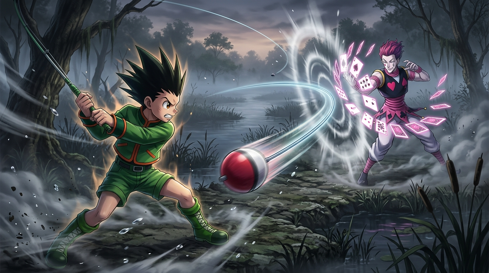

# 🖼️ 純粹的野性之眸：釣竿奇襲與青澀果實 (Pure Wild Eyes: The Fishing Rod Strike and the Unripe Fruit)

本作品源自閱讀《HUNTER x HUNTER 獵人》（`hunter-x-hunter`）第 2 卷第 9 話〈霧中交鋒〉的閱讀心得感悟。

當西索的致命之手即將捏碎雷歐力的咽喉之際，濃霧中破空呼嘯而至的不是刀劍，而是一顆重型球狀浮標——小傑揮動手中的釣竿，在千鈞一髮之際狠狠擊中魔術師的面門，強行打斷了行刑。即使隨後被西索單手扼住脖子凌空提起、面臨窒息與死亡的威脅，小傑那雙澄澈而野性的大眼睛也未曾流露出一絲屈服，反而如初生幼狼般死死瞪著強敵。

畫面定格了釣竿破空甩出的衝擊波與西索撲克牌防禦的動態碰撞。小傑全力以赴的身姿與眼中不滅的野性之火，正是將西索從純粹的殺戮衝動轉化為培育「青澀果實」期待的關鍵轉折點。

