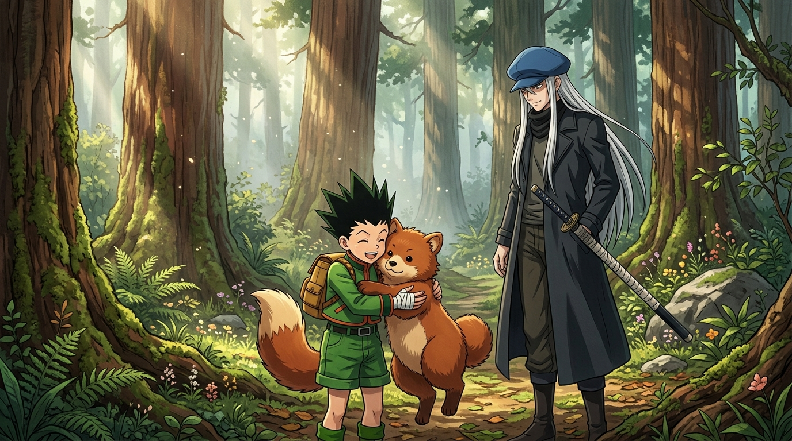

# 🖼️ 森林的重拳與生態界線 (Kite''s Boundary and the Foxbear King)

> **「有哪個有大腦的人會在這種時候跑進樹林裡來！敬畏邊界，才是獵人與野獸共存的鐵則。」**

### 🎨 創作感悟與視覺母題

本作品改編自《全職獵人》（`comic-hunter-x-hunter`）第 1 卷 No.001〈出發的日子〉之三年前回憶篇。

凱特拔刀斬殺母狐熊救下九歲的小傑，隨即回身給了不知死活闖入領地的小傑一記嚴厲的重拳。這段故事奠定了整部作品最冷靜的生態哲學：
力量不是拿來肆意侵犯自然的特權，而是用來守護界線的職責。小傑用溫柔與身體護住瀕死的小狐熊，三年後小狐熊長成獨立威嚴的「森林之王」，小傑也遵守界線不再相見。晨光穿透巨杉樹冠，凱特修長的身影與腰間佩刀，在小傑心中刻下了金・富力士的傳奇名字，也點燃了航向廣闊世界的引力。

