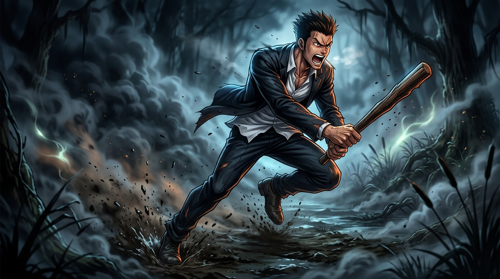

# 🖼️ 男兒之傲骨：忍不下的那一記回頭 (The Pride of a Man: Turning Back for Defiance)

本作品源自閱讀《HUNTER x HUNTER 獵人》（`hunter-x-hunter`）第 2 卷第 9 話〈霧中交鋒〉的閱讀心得感悟。

在失美樂濕地的濃霧中，西索以「主考官遊戲」殘忍獵殺了十餘名圍攻他的考生。酷拉皮卡與雷歐力親眼目睹這壓倒性的絕望差距後分頭奔逃。然而，跑出數十步後的雷歐力突然停下了腳步——他無法忍受眼睜睜看著夥伴被視如草芥、更無法嚥下那口因恐懼而逃竄的恥辱。他明知實力如同天壤之別，仍咆哮著掄起粗木棍悍然衝向西索。

畫面凝固了雷歐力在泥濘與毒霧中暴衝而出的狂烈身影。撕裂的衣角、怒目圓睜的咆哮與手中沉重的木棒，彰顯了他雖然缺乏超凡力量，卻擁有最純粹、不容踐踏的男兒骨氣。那是一記明知必敗卻絕不低頭的悲壯反擊。

