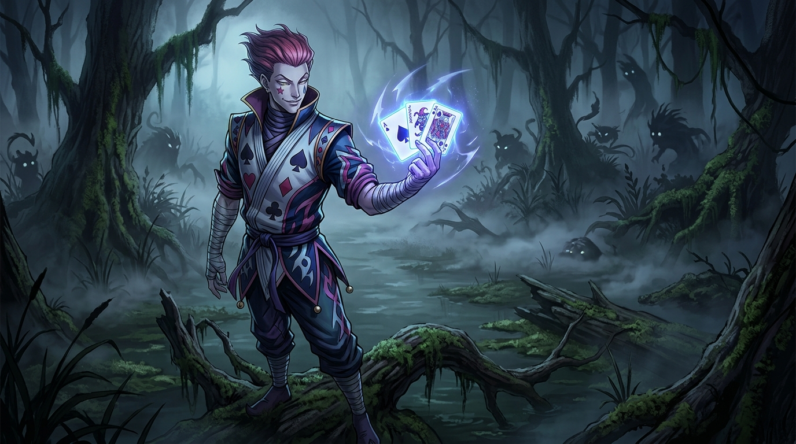

# 🖼️ 失美樂濕地的魔術師：絕對武力與欺詐之霧 (The Magician of Numere Wetlands: Absolute Force and the Fog of Deceit)

本作品源自閱讀《HUNTER x HUNTER 獵人》（`hunter-x-hunter`）第 1 卷第 8 話〈各懷鬼胎〉的閱讀心得感悟。

失美樂濕地（又稱騙子巢穴）是獵人試驗第一回後半的殘酷舞台。這裡的生物全靠欺騙與擬態誘捕獵物，甚至連「考官是假的、我才是真的考官」這種直擊人心的挑撥都成了捕食鏈的一環。就在所有考生陷入猜忌與動搖之際，魔術師西索僅憑兩張射出的撲克牌，以最純粹且致命的暴力邏輯直破困局——「真正的考官不可能接不下這種攻擊」。

畫面捕捉了西索站在毒霧瀰漫的枯木沼澤中，神態自若地微揚嘴角、指間撲克牌鋒利如刃的光影。那不僅是對虛假偽裝者的裁決，更是將生存遊戲的主導權從環境掠食者手中硬生生奪回的絕對強者姿態。

