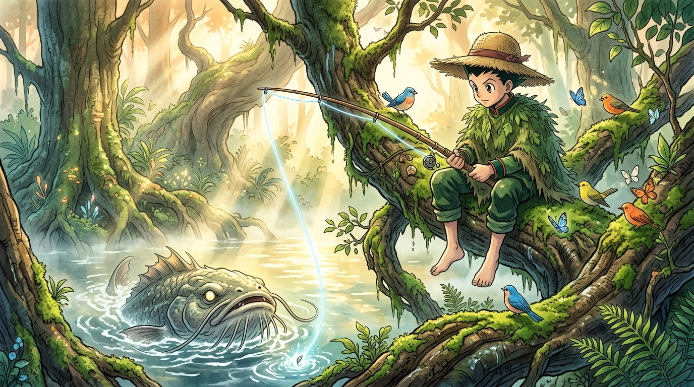

# 🖼️ 古樹垂綸與沼澤之主 (The Lord of the Lake and Silent Patience)

> **「五個成年人都拉不上來的沼澤之主，在安靜化身為樹木枝葉的少年面前躍出水面。」**

### 🎨 創作感悟與視覺母題

本作品改編自《全職獵人》（`comic-hunter-x-hunter`）第 1 卷 No.001〈出發的日子〉。

米特阿姨開出釣起「沼澤魚精」作為出發的考驗，原以為能藉此阻擋小傑踏上危險的旅程。然而畫面中展現的並非粗暴的蠻力抗衡，而是少年與鯨魚島古老沼澤的深層同調——
小傑身披樹葉偽裝、頭頂草帽，與棲息在身旁的鳥雀、蝴蝶化為同一道風景。晨曦穿透林間薄霧，在水面泛起粼粼金光；當深淵中的巨魚浮出水面咬鉤的那一刻，野性的直覺與靜止的耐心在水花間昇華為獵人冒險的起點。

