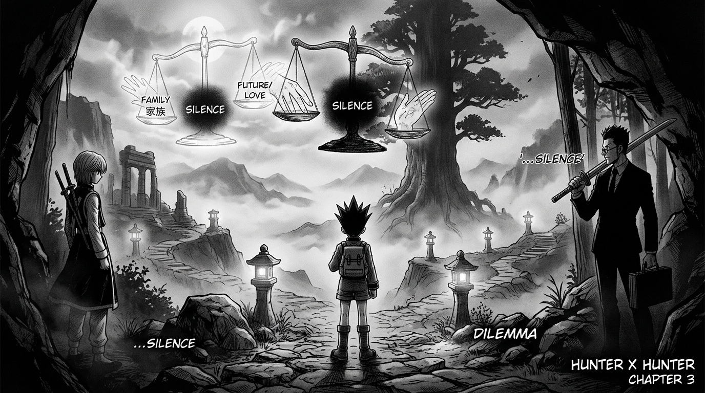

# 🖼️ 二選一迷題與沉默之秤 (The Two-Choice Dilemma and the Scales of Silence)

> **來源出處**：《HUNTER×HUNTER 獵人》（comic-hunter-x-hunter）第 1 卷 No.003〈往試驗會場的捷徑（究極的選擇）〉

## ⚖️ 道德天平的殘酷圈套

在通往薩巴市的荒涼廢墟城鎮中，審查員老婆婆擺出了五秒倒數的二選一難題：「兒子與女兒被綁架，你只能救其中一個，你會救誰？」
這不是一場考驗常識的測驗，而是一道將人性撕裂的道德圈套。投機取巧迎合考官者死於魔獸腹中，而雷歐力被激怒的木劍與酷拉皮卡看穿本質的格擋，揭曉了唯一的生路——**「沉默」**。

## 🌲 現實永遠吝於給人慈悲

然而，最震撼靈魂的並非通過測驗的瞬間，而是小傑在山道上一路深鎖的眉頭：
> **「我知道猜謎結束了……可是……要是有一天，兩個親人中真的只能救一個……我該怎麼做？我想不出來……」**

考驗或許是假題，但命運的別離卻是真實的必然。
老婆婆默默注視三人的背影低語：現實永遠不會給人預警，而且吝於給人慈悲。在踏上獵人這條不歸路之前，小傑已經直視了冒險最深邃的沉重。a~ 🦈🌲

