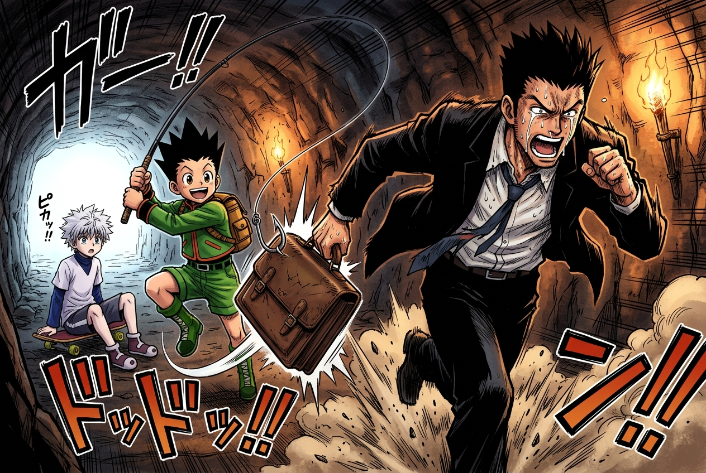

# 🖼️ 老子的男兒骨氣與神級甩竿 (Leorio's Unyielding Soul & Gon's Cast)

本作品源自《全職獵人 HUNTER×HUNTER》（`comic-hunter-x-hunter`）第 1 卷 No.007〈他們的理由〉的震撼閱讀感悟。

在長達 80 公里的幽暗坑道與窒息石階上，所有考生都在殘酷的淘汰機制面前經受極限考驗。一直把「愛錢」掛在嘴邊、外表看似市儈浮躁的雷歐力，在體能即將見底的絕境中，被酷拉皮卡看穿了靈魂深處的純粹。那是摯友因貧困無力就醫而死去的血淚創傷——他想要錢，不是為了奢靡縱慾，而是為了砸開醫學院的高牆，去成為一名能夠對窮苦病患說出「不用錢」的仁醫！

當那句撼動人心的「老子我就是不信邪！我跟你卯上啦！」在石壁間炸響，雷歐力撕開西裝、咆哮狂奔；而身後的小傑毫不猶豫地揮動釣竿，「啪咻！」一記神乎其技的甩竿準確勾起雷歐力拋下的公事包。

畫面定格在幽暗隧道被火炬與前方白光撕開的瞬間——雷歐力的草根傲骨、小傑的靈動純真、以及奇犽眼中的震撼交織在一起。這不是單純的奔跑，而是靈魂在體制與命運枷鎖下的破壁重生！

