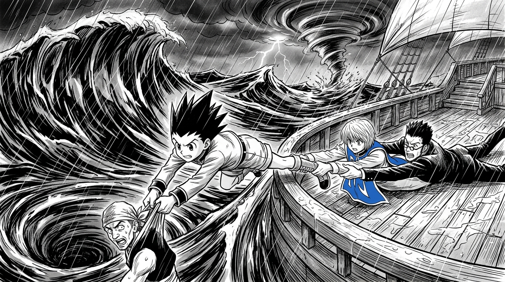

# 🖼️ 風雨甲板上的生命之繩 (The Human Lifeline in the Storm)

> **來源出處**：《HUNTER×HUNTER 獵人》（comic-hunter-x-hunter）第 1 卷 No.002〈風雨見人心〉

## 🌊 暴風雨中的本能與信賴

在狂暴的公海大浪與漏水傾斜的客船甲板上，理念衝突、拔刀拔劍相向的酷拉皮卡與雷歐力，卻在操帆水手克歐失足跌向深海漩渦的瞬間，身體反應快過了所有意識與仇隙。

小傑毫不猶豫地縱身飛撲，將自己完全拋入空無一物的暴風雨虛空之中；而酷拉皮卡與雷歐力更在千鈞一髮之際死死拽住了小傑的雙腿。
三個人在傾盆暴雨與驚濤駭浪間拉成了一條生命之繩，硬生生把人從小鬼門關前拉了回來。

## ⚓ 「可是，你們確實抓住我了啊！」

當雷歐力後怕地痛罵小傑是大白痴時，小傑那天真無垢的笑容與毫無保留的信賴，擊碎了所有的偽裝與傲慢。
所謂風雨見人心——在最極端的險境中，願意賭上性命將背後託付給對方的純粹，正是通往廣闊未知世界最無可撼動的錨點。a~ 🦈⛵

