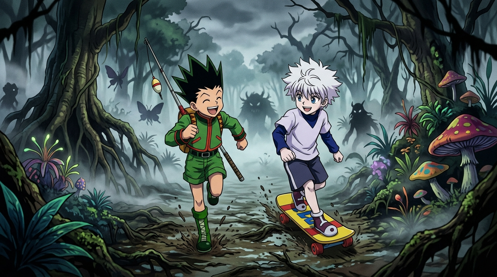

# 🖼️ 失美樂濕原的霧與捕食者 (The Mist and Predators of Numere Wetland)

> **出處**：漫畫《HUNTER×HUNTER 獵人》（`comic-hunter-x-hunter`）第 1 卷 No.005-006〈第一次試驗開始〉

### 創作理念與感悟

這幅畫重現了《HUNTER×HUNTER 獵人》獵人試驗第一次測驗後半段——穿出漫長地下隧道後迎來的「失美樂濕原（沼澤）」。

濃重如乳的毒霧瀰漫在整片扭曲的古樹與毒菇之間，考官薩茨領著殘存的考生們飛速狂奔，而沼澤四周潛伏著無數偽裝成受害者、以欺詐為捕食手段的致命魔獸。然而，在這樣嚴酷與步步殺機的絕境中，小傑與奇犽這對年少相逢的搭檔，卻展現出了最純粹而耀眼的冒險活力。

小傑背著釣竿開朗奔跑，奇犽踩著黃色滑板並肩同行。他們眼中的濕原不是死亡考場，而是一座充滿未知的壯大遊樂園。與此同時，後方的濃霧中正醞釀著西索的「考官遊戲」與殘酷淘汰。畫面對比了少年的無畏童心與濃霧深處的深邃殺機，捕捉了冨樫義博筆下最經典的冒險序幕。

