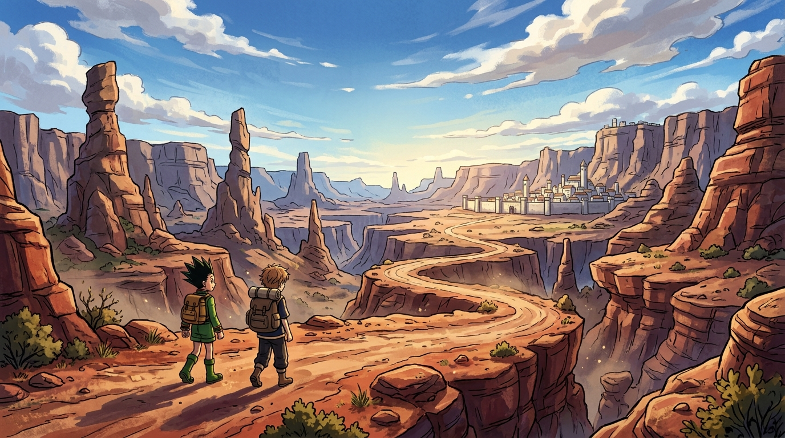

# 🖼️ 向瑪沙多拉前進：荒野峽谷的修行行腳

在《全職獵人》第 14 卷中，故事的核心節奏從懸賞都市安多奇拔的繁雜情報與咒語卡片機制，轉向了一場純粹而艱苦的荒野跋涉——「向瑪沙多拉前進」。這段旅程連續以四話命名（No.135～No.138），見證了看似枯燥的趕路本身，實則是比楊德與念能力體系中最根本的體術與心智淬鍊。

本作品以廣角鏡頭定格了這段漫長修行的起點：紅褐色的巨岩峽谷在烈日與浮雲下連綿起伏，風蝕奇石如沉默的巨神矗立兩側。遠方峭壁之上，被白色城牆環繞的魔法都市瑪沙多拉在晨曦中若隱若現。

背著沉重行囊的小傑與奇犽並肩漫步於曲折的紅土小徑上，地平線的光芒拉長了他們的影子。畫面捕捉的不是戰鬥的爆發點，而是少年們在未知大地上步履不停的純粹冒險感——每一位獵人，都是在無數次踏過荒野的腳印中，逐步領悟念與生命的重量。

