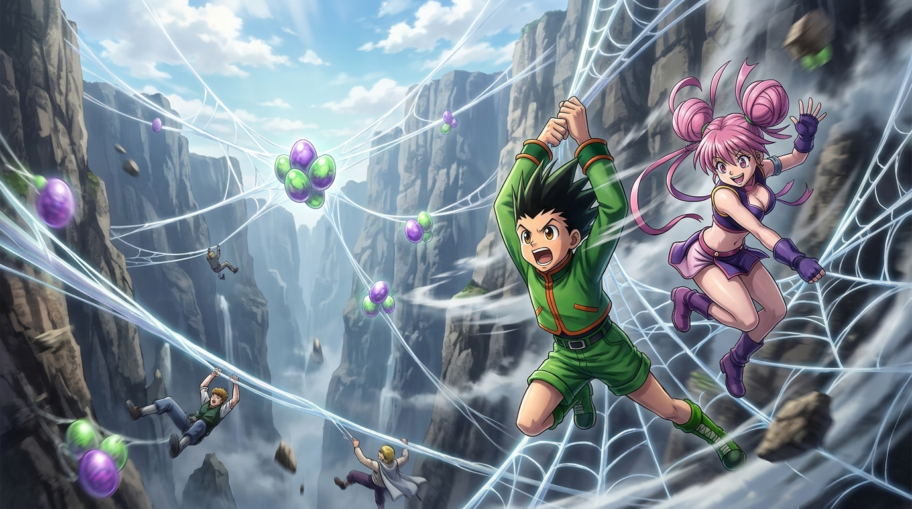

# 🖼️ 絕壁縱身：瑪虎山的葡萄蛛之卵 (Leap into the Abyss: The Grape-Spider Eggs of Mt. Split-Head)"

### 創作理念與感悟

本作品取材自冨樫義博漫畫經典《獵人 HUNTER×HUNTER》（`comic-hunter-x-hunter`）第 2 卷 No.012〈會長現身〉。

在第二回合料理測驗中，考生們對美食獵人嗤之以鼻，引發考官門淇宣布合格者從缺。然而在尼特羅會長斡旋下，門淇帶領所有人來到瑪虎山的大裂谷，並由她親自跳下懸崖示範如何採集「葡萄蛛的卵」。

畫面定格在小傑與門淇毫不猶豫躍出懸崖、在萬丈深淵與狂暴氣流中精準抓握堅韌蛛絲的一瞬。遠處雲霧繚繞的裂谷絕壁上掛滿了晶瑩剔透的蛛卵，陽光穿透裂谷，照亮了少年眼中的野性光芒與考官極致專業的英姿。

這幅畫的核心在於破除「結果論的輕佻」——一顆看似尋常普通的「白煮蛋」，在餐桌上人人都能吃得津津有味，但在荒野中，它的誕生卻伴隨著直面深淵的粉身碎骨之險。門淇用這一跳證明了：真正的專業自尊不是靠頭銜去壓制他人，而是能夠在最危險的懸崖前親自縱身一躍，用實打實的行動讓所有人肅然起敬。

