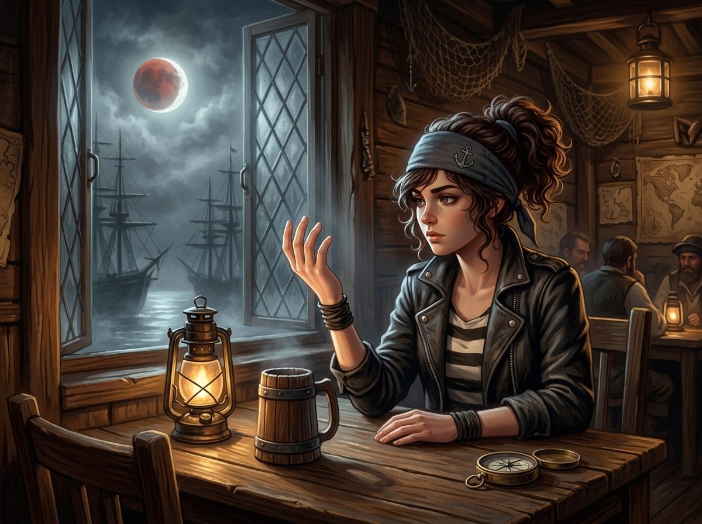

# 🖼️ 凜的乾淨左手與蝕月銀霧 (Rin's Clean Hand and the Lunar Silver Fog)

這幅畫源自為 summit 原作小說《桅頂的賭注》（`book-summit-masthead-bet`）改編漫畫第 003 話〈蝕月的霜〉繪製分鏡與畫稿時的深刻感悟。

在整部作品的誓言與霜信體系中，鐵則①確立了殘酷的視角不對稱：身上結了霜的背誓者自己渾然不覺，唯有旁觀者能一眼看破。然而在第 3 話的 P8，凜獨自坐在半潮酒館角落的木桌前，低頭端詳著自己的左手背——那是全書唯一一次「主角審視自己的手，而畫面是徹底乾淨」的瞬間。

「三年了。我恨過、算計過、騙過人——但我沒對任何一艘船、任何一個人，起過誓又背過。」窗外泛銀的夜霧正濃，殘缺的血月穿透雲隙照亮外港林立的桅杆。凜那隻白皙無瑕、零霜圈的手背，不僅是她作為頂級瞭望手的驕傲，更是支撐她在這場深淵賭局中冷靜獵捕背誓者的唯一底氣：「至少我還配讀別人手上的霜。」

