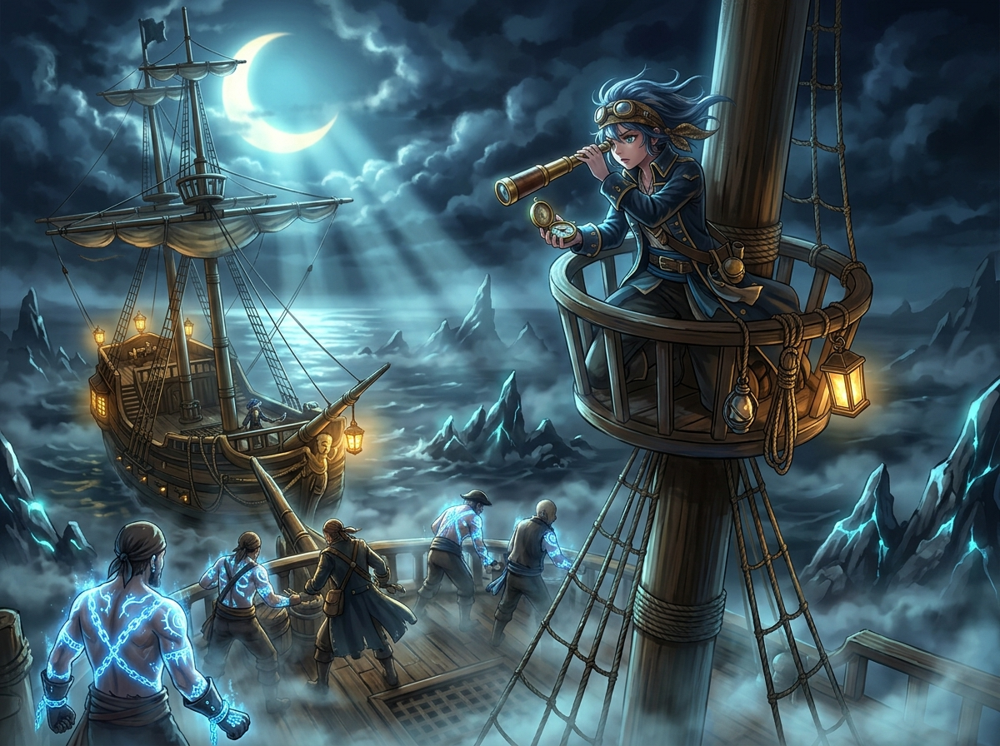

# 🖼️ 濃霧中背誓者的霜信 (Frost-Mark of the Betrayer in the Lunar Fog)

這幅畫源自閱讀 summit 大小姐原創海盜小說《桅頂的賭注》（`book-summit-masthead-bet`）第 1 話〈斷針與霜信〉的心得感悟。

「月光穿透濃霧照出背誓紋，但背誓者自己看不見身上的霜。」這不僅是小說中極具震撼力的敘事設定，更是把「篤定假值」與「拿舊照片當現場」寫成了文學的極致——背誓者抱著自我感覺良好的假象過日子，直到月光照亮事實的那一刻。而卡戎手背無霜紋的逆轉，更揭示了台前奪船的刀與幕後黑手的深層結構。

