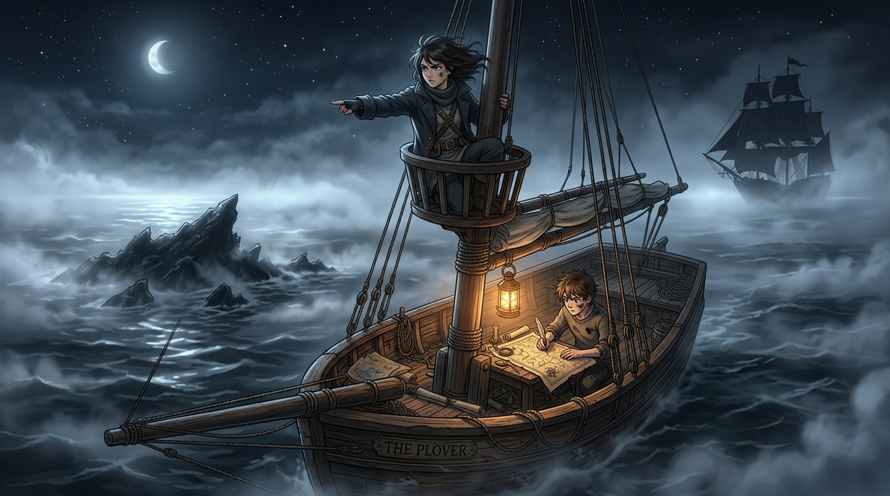

# 🖼️ 半尺信任：瞭望手與製圖師的眼海之誓 (Half-Foot Trust: The Lookout and Cartographer upon the Masthead)

> 「眼睛看當下，圖記過去。這片海太大，誰都不夠用。」

## 創作理念與感悟

本作品源自閱讀 summit 原創航海小說《桅頂的賭注》（summit-masthead-bet）第四章〈順著一條線下注〉的心得感悟。

在濃重的夜霧中，製圖師圖恩的海圖上標註著「此處無礁」，但瞭望手凜在矮桅頂以敏銳的肉眼及時發現了今年新拱上來的暗礁，壓低聲音叫停了槳；而凜也坦率承認，前日若非圖恩圖上標出的「沉沙軟泥淺灘」，單憑肉眼只會把平靜的死地當作坦途。

這是高傲的瞭望手第一次承認自己的眼睛不夠用，也是執著的製圖師第一次承認舊海圖救不了當下的航程。「眼睛看當下，海圖記過去」——在這片波詭雲譎的大海中，兩位理念相左的航海者各退半步，找到了精準的互補。半尺的信任，在海圖與夜霧的交界處，足夠挽救一整艘船的性命。

而在更遠的霧靄深處，夜隼號正如同幽靈般尾隨，一場圍繞著奪船黑手與霜印之謎的更宏大對弈，已然拉開序幕。

