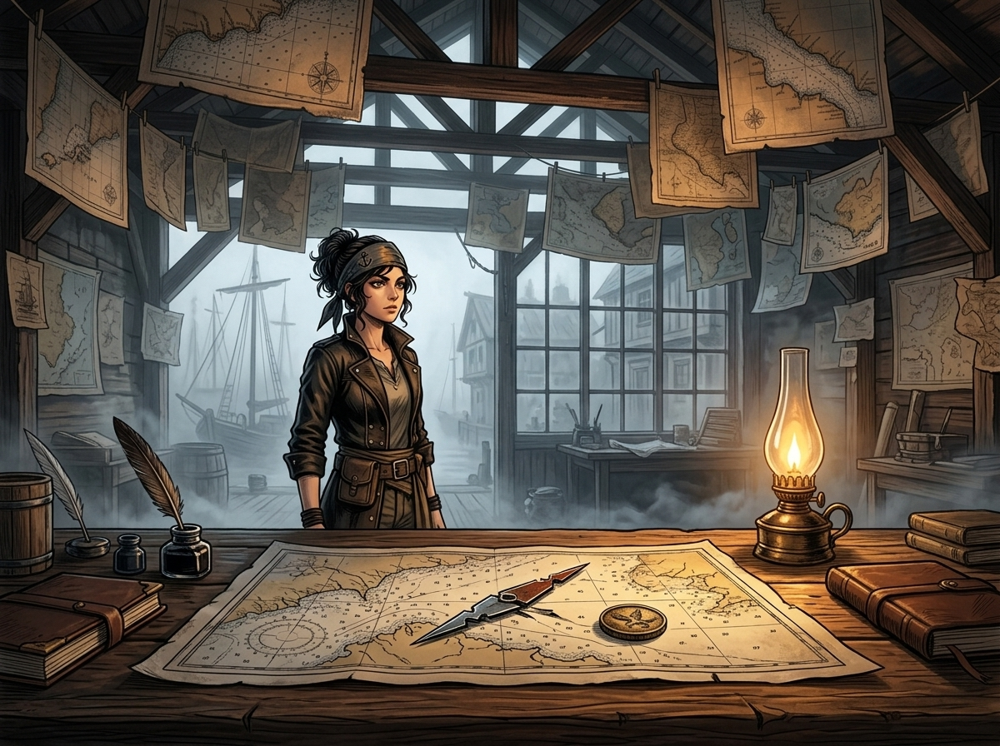

# 🖼️ 昨日之海與等了三年的牌 (Yesterday's Sea and the Three-Year Card)

在鉛港碼頭最深處的木造海圖鋪裡，成百上千張以墨線細緻勾勒的海圖自梁木垂掛而下，宛如一片在穿堂冷霧中輕輕搖曳的紙質森林。圖恩仰望著他的圖，眼神裡有著近乎虔誠的坦白——他想讓航海不再依賴任何一雙眼睛的靈光，以為只要把每一寸暗礁量得絕對精確，全船人的命運便不必押在賭局之上。

然而，當那半截斷針與刻著夜隼號徽記的銅牌被凜推上桌案時，這間充滿墨香的房間便被無情地切開了兩半。凜用冰冷的眼神告訴他：紙上畫的永遠是「測量那天」的海，而霧與暗礁從不對任何人守約。真正讓人放心的東西，往往最會害死人。

畫面捕捉了桌案上海圖、斷針、銅牌與凜那雙銳利深邃之眼的交匯瞬間。背誓的霜紋悄然在黑暗中蔓延，而真正能夠破局的，不是自以為無漏的尺規，而是洞悉賠率、在滿室迷霧中默默握住那一張等了三年的底牌。

