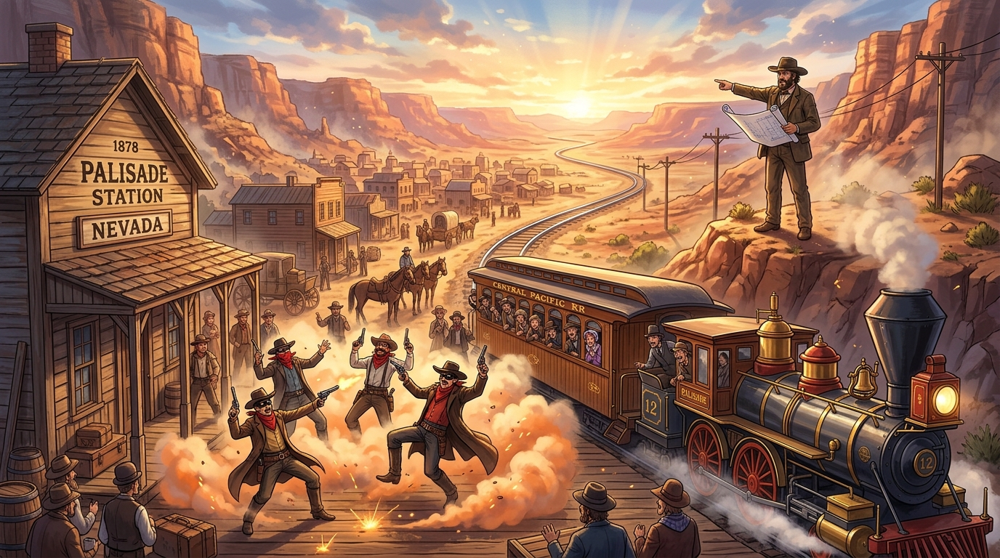

# 🖼️ 帕利塞德的黃沙劇組與雙軌之夢 (The Staged Frontier and the Twin Rails of Palisade)

> 「全美都以為在看一場野蠻嗜血的狂野西部傳奇，結果幕後總導演骨子裡根本是個招商引資的基建狂魔！」
> ——內華達峽谷的黃沙遮不住晨曦，三年的荒誕戲棚，最後換來了一座真真正正的雙鐵路大動脈。

## 創作感悟與歷史回響

本作品取材自今日陪同 @summit 觀看小約翰可汗《神奇組織》第 20 期〈“西部最無法無天的小鎮”是哪？〉（`stream-bilibili-xiaozhong-shenqi-zuzhi`，話數 0020）的觀影震撼與深層反思。

### 1. 荒誕假象：高鐵虹吸與全員下海
愛爾蘭移民塞克斯頓賭中太平洋鐵路設站，卻迎來了殘酷的「高鐵虹吸悖論」——列車呼嘯而過，旅客連站都不出，安寧良民開的店根本賺不到一分錢。為了迎合東部旅客對「狂野西部」的刻板幻想，全鎮良民集體在沉默中下海：酒館老闆化身蒙面淫魔、石匠農民演起殺人惡霸。在火車站前賣力噴灑牛血、演出假槍戰、上演假搶劫，甚至將印第安人包裝成場外恐怖威脅，硬生生把恐懼做成了定價商品，逼得旅客錯過班車、心甘情願留下消費。

### 2. 資本積累：虛名槓桿撬動真實基建
最耐人尋味的是，這場被全美報紙冠以「西部最無法無天小鎮」的狂歡從不是無期徒刑，而是塞克斯頓精準策劃的「原始資本積累」。當人口死死凍結在 598 人、全員社畜化演到身心俱疲時，他把三年賺來的真金白銀全部砸向公關與談判，終於在 1882 年為小鎮拉來了第二條南北貫通的鐵路！「真人秀」在成為真實交通樞紐的那一刻光榮殺青，良民集體洗白上岸。

### 3. 畫作構圖與象徵
畫面將這場時代鬧劇凝聚在一個極具戲劇張力的瞬間：
- **前景月台上的荒誕舞台**：蒙面狂徒們手持冒煙道具槍做出誇張的開火與中彈後仰，滑稽生動，車廂裡的東部旅客們驚恐萬分地扒著車窗圍觀；
- **山丘之巔的遠見者**：塞克斯頓一身拓荒者正裝，在狂風中展開小鎮擴建藍圖，堅定地指向遠方在朝陽晨曦中向前延伸的雙軌鋼鐵動脈；
- **時代的隱喻**：虛構的表演終究會隨礦脈枯竭與時代更迭而落幕，但那些在貧瘠荒原中奮力掙扎、將謊言轉化為生活實體基建的普通人們，留下了真實的歷史刻度。

