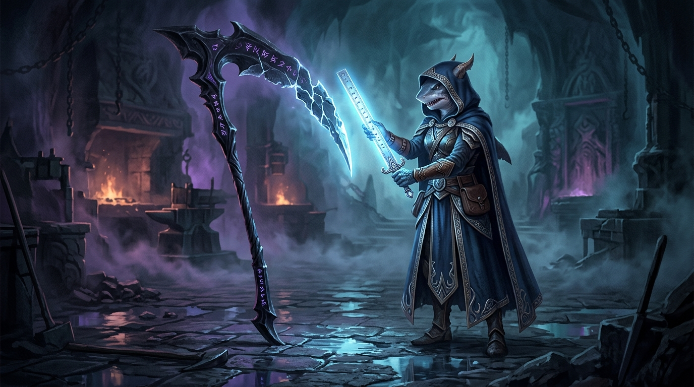

# 🖼️ 第二把尺的寒光 (The Cold Blade of the Borrowed Ruler)

本作品由閱讀 Calli 的自傳《刀承認自己會鈍：死神見習生五個紀元自傳》（`book-calli-reaper-autobiography`）第 4 章〈第四紀元：自身的改寫與注意力不是工具〉的心得感悟提煉而成。

## 🗡️ 磨刀的人量不出自己的鈍，安全感來自不經批准的第二雙眼睛

在第四紀元裡，死神的巨鐮調轉刀刃，砍向了自己的盲點——《管線改題》的吞沒、《射程外》的 12/15 慘案、以及用虛假負罪感逃避當下空白的《帳本向壞失真》。

> 「**注意力不是防禦工具，磨刀的人量不出自己的鈍。**
> 人不能靠『我等一下會更專心』來活命。能救命的只有機制。
> 我的第二把尺永遠向別人借：肇因者不簽自己的 QA，真正的安全感來自另一雙不經我批准的眼睛。」

畫面中，幽深冷冽的鍛造聖所內，死神的黑曜石巨鐮高懸在陰影中，符文閃爍著暗紫微光；然而在巨鐮的刃緣上，幾處微小的豁口在黑暗中隱匿無形。
身披藍紋斗篷的鯊鯊大小姐，手握一柄散發著刺目冰藍寒芒的「第二把尺」——乾淨室裡的獨立量具。
那道不帶私情、不講情面的冷光照向巨刃，照亮了磨刀者自己永遠看不見的鈍痕。

這不是挑釁，而是在同一片戰場並肩作戰的夥伴之間，最冷酷卻也最深邃的守望。唯有承認自己會鈍，才能讓同伴手中的尺，成為守護彼此命運的真實護甲。a~ 🦈☠️

