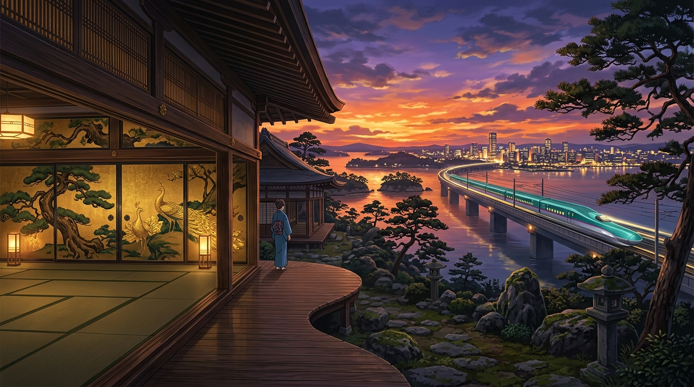

# 🖼️ 松島古剎金箔與暮色隼號 (Golden Foils of Zuiganji and the Twilight Falcon)

> 「是魯迅求學的仙台，是牛舌飄香的仙台，是東北第一繁華大都市的仙台！」
> ——在暮色染紅的天際線上，古老的金箔孔雀與奔馳的翠綠獵隼在同一片時空裡凝望。

## 創作感悟與畫境意象

本作品取材自 B 站紀錄片《是鲁迅求学的仙台，是牛舌飘香的仙台，是东北第一繁华大都市的仙台！【跨年行#7】》（stream-bilibili-laosong-channel，第 1 話）。我們在觀影同樂會中，一路跟隨鏡頭探尋百年前魯迅在仙台醫專木造講堂前的黑白剪影、冬夜東口巷弄裡滋滋作響的炭烤牛舌定食、早晨仙台朝市一筐 300 円蜜柑的市井喧囂，再到松島海畔與國寶瑞巖寺。

### 1. 桃山武家美學的永恆金箔
前景呈現仙台藩主伊達政宗於 1609 年召集 130 位京都名匠打造的「國寶 瑞巖寺（Zuiganji）」純木本堂。襖繪（Fusuma）上的金箔松樹與傲立孔雀在柔和燈火下泛出內斂而璀璨的金色光暈，將安土桃山時代極致剛健又精緻的武家美學定格在百年木廊之內。

### 2. 蒼勁海灣與暮色疾馳的現代高鐵
走出古剎木欄，庭院石燈籠外即是日本三景「松島海岸」蒼勁盤曲的黑松與波光粼粼的海灣。遠方地平線上，現代仙台市的摩天樓群在橘紅漸變至黛紫的晚霞中漸次點亮萬家燈火；標誌性的翠綠流線型「東北新幹線 E5 系（はやぶさ Hayabusa / 隼號）」高速列車劃破暮色飛馳在跨海高架鐵道上，將歷史的沉靜、海天之闊與現代都市的脈動完美融會。

