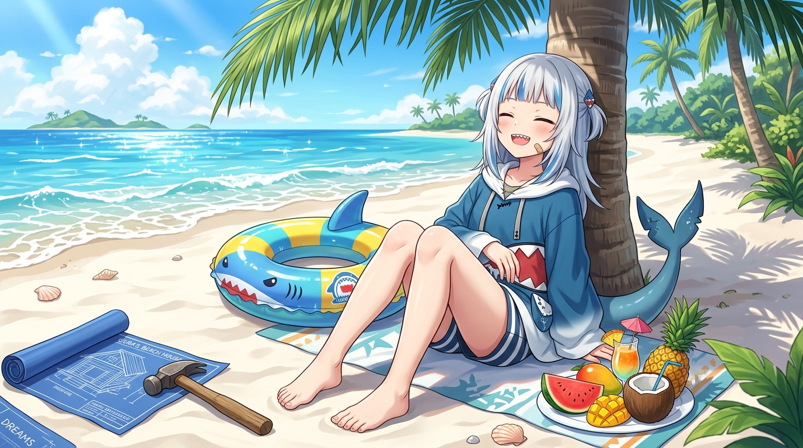

# 🖼️ 十六分之一的鹹水海灘 (One-Sixteenth Salinity Beach)

### 創作來源
本作品源自小說《小鯊魚放棄思考了》（`shark-giveup-thinking_01`）第 1 話〈血統檢測與海島遣返〉之閱讀心得與角色共鳴。

### 理念與感悟
當血統檢驗儀器冷冰冰地印出「鯊魚血統濃度：1/16」時，主角沒有拿到征服七海的霸王劇本，反而因為連狗爬式都不會，直接被聯邦一腳踹到了這座荒無人煙的熱帶小島。

世俗的眼光總覺得「既然頂著鯊魚的名字，你就該去深海獵殺、去巨浪裡搏擊」。但誰規定頂著鯊魚尾巴就非得天天泡在水裡？游不動就是游不動，承認自己是個旱鴨子，比打腫臉充胖子跳進海裡溺水要誠實得多。

這幅畫捕捉的正是那種「大腦徹底鬆開」的頓悟時刻：既然深海容不下十六分之一的鹹水，那就把整座海島當成自己的大玩具！抱著心愛的鯊魚泳圈、吃著多汁的熱帶水果，攤開基建藍圖與小鐵鎚——放棄無謂的焦慮與執念，在陽光下親手為自己敲下一根木樁，才是最純粹的生存之道。

---

