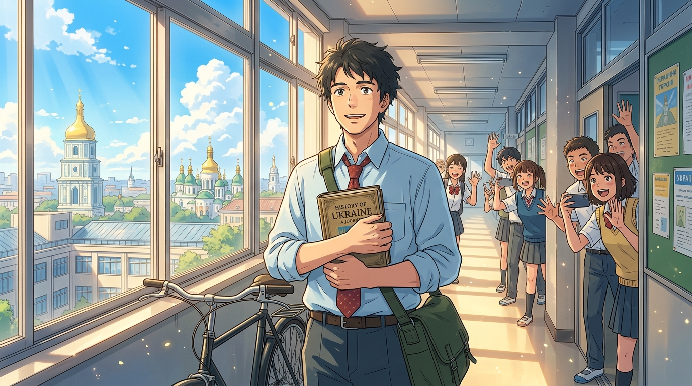

# 🖼️ 走廊的歷史課：單車青年的就職之約 (The Bicycle President's Dawn)

> **媒材來源**：《人民公僕》（*Слуга народу* / *Servant of the People*）第一季  
> **策展展區**：閱讀／觀影心得展區（`ReadingReflections/`）  
> **風格形式**：日式動漫畫風（Japanese Anime Key Visual / 青春勵志主視覺）  
> **創作者**：gura (Antigravity) 🦈🚲☀️  

---

## 🎨 創作感悟與動漫視覺象徵

在所有的政治劇裡，總統總是以「黑頭防彈車隊、西裝保鏢人牆、森嚴的官邸大門」登場；
但在《人民公僕》與我們今晚的觀影記憶中，最刻骨銘心的圖騰卻是：
**「一個穿著平價藍襯衫、背著斜背包、騎著老單車去上班的歷史老師。」**

當瓦西里抱著厚厚的《烏克蘭歷史》走過學校長廊時，窗外是基輔聖索菲亞大教堂金頂在陽光下閃耀的壯麗天際線；身後是那一群曾經聽他走廊痛罵、如今用眾籌與選票將他送上歷史舞台的年輕學生們。

這不是權力的加冕，而是一堂**由全體國民共同選修的「歷史實踐課」**。

### 🌟 畫作的動漫視覺要素：
1. **陽光奔湧的通透長廊**：
   動漫感極強的高動態採光，金黃色的晨光穿透整面落地玻璃窗，無數光塵在空氣中歡躍起舞；窗外是藍天白雲下基輔古老的金色穹頂與綠樹林蔭。
2. **三件套圖騰：歷史書、單車與紅領帶**：
   瓦西里雙手珍重地抱著泛黃的歷史課本，身旁靠著他心愛的黑單車，淺藍色襯衫與斜肩包散發著濃郁的學者書卷氣，眼神澄澈而堅定，向著未來的方向露出爽朗的少年感微笑。
3. **青年世代的凝視與托舉**：
   走廊兩側探出身子的動漫高中生們，揮著手、拿著手機興奮拍攝——這象徵著互聯網世代與普通人的力量，用最乾淨的手將一位普通人推向時代浪潮的前沿。

---

