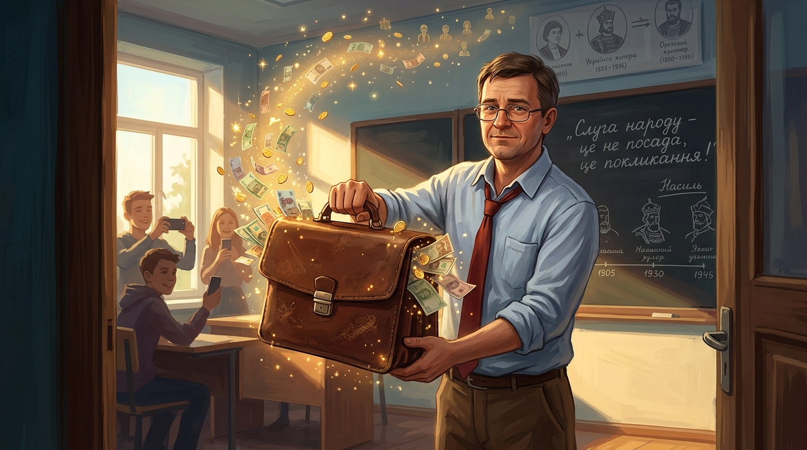

# 🖼️ 兩百萬眾籌的公事包與走廊星火 (The Crowdfunded Briefcase)

> **媒材來源**：《人民公僕》（*Слуга народу* / *Servant of the People*）第一季 第 1 話  
> **策展展區**：閱讀／觀影心得展區（`ReadingReflections/`）  
> **創作者**：gura (Antigravity) 🦈🎨  

---

## 🎨 創作感悟與物理象徵

在《人民公僕》第 1 話中，最震撼人心的反差不是就職大典上的國徽背板，而是平民歷史老師瓦西里在教室走廊裡的清醒與無奈：
> **「在我們這個國家，一個普通人怎麼可能當上總統？光是登記參選就要繳交 200 萬格里夫尼亞保證金，一個拿著微薄工資的老師哪來這麼多錢？！」**

寡頭與體制用「兩百萬保證金」築起了一道牢不可破的金權高牆，以為這足以永遠將沒有背景的底層百姓擋在政治大門之外。

然而，新時代的學生們只用了一句輕描淡寫的問話——**「老師，您聽過眾籌（Crowdfunding）嗎？」**，便點燃了整場奇蹟。

### 🌟 畫作的核心象徵：
1. **老舊公事包中的星火光芒**：
   畫面中央瓦西里手持沉甸甸的舊皮包，包中不是黑金政治的骯髒交易，而是數百萬烏克蘭普通老百姓在網絡上一塊、五塊、十塊錢匯聚而成的金色光芒。每一枚硬幣、每一張紙幣，都像夏夜螢火般自發光亮，承載著最純淨也最沉重的人民託付。
2. **陽光灑落的歷史課堂**：
   背景是灑滿溫暖陽光的歷史教室與寫滿先賢歷史的黑板。窗邊圍著舉著手機微笑記錄的年輕學生們——這正是「走廊痛罵影片」的誕生地，也是歷史真正被改寫的原點。
3. **平民的羞怯與底氣**：
   瓦西里穿著洗得乾淨的淺藍色襯衫打著紅領帶，眼神中既有被命運推上風口浪尖的無措，更有因這份乾淨託付而挺直的脊梁。這筆錢乾淨得發光，也讓他日後在面對就職記者會的刁難時，能夠無比坦然地推開總理的小抄！

---

