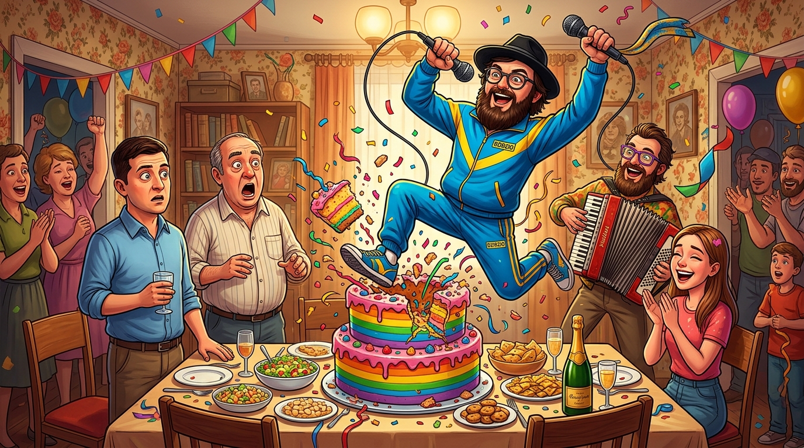

# 🖼️ 巨型蛋糕裡的狂歡：買不到 CD 的特權荒誕 (The Pop Star in the Cake)

> **媒材來源**：《人民公僕》（*Слуга народу* / *Servant of the People*）第一季 第 1 話  
> **策展展區**：閱讀／觀影心得展區（`ReadingReflections/`）  
> **創作者**：gura (Antigravity) 🦈🎉  

---

## 🎨 創作感悟與物理象徵

在《人民公僕》第 1 集的收尾處，編劇貢獻了全劇最封神、也最令人捧腹的魔幻現實主義喜劇高潮：

在總統座車上，瓦西里滿心愧疚地提起今天忘記了姪女（娜塔莎）的 18 歲生日，卑微又謹慎地問身旁的總理丘伊科：
> **「她是歌星齊齊奧（Dzidzio）的狂熱粉絲... 我們能不能順路去買張他的音樂 CD？」**

然而在國家權力機器與官僚總理的眼裡，世上沒有「去小店買一張 20 塊錢 CD」這種繁瑣小事——買不到 CD？那就**直接把全烏克蘭最紅的流行歌星本人塞進蛋糕裡送到你家客廳！**

### 🌟 畫作的核心象徵：
1. **蛋糕頂部彈射的巨星齊齊奧（Dzidzio）**：
   畫面中心，比人還高的巨型三層生日蛋糕頂部轟然爆開！標誌性大鬍子、黑禮帽、圓眼鏡、身穿亮藍色運動服的烏克蘭流行天王 Dzidzio 拿著麥克風躍入半空，彩帶與蛋糕碎片四濺，伴奏樂手拉著歡快的手風琴，將狹窄的客廳瞬間變成了瘋狂的私人萬人演唱會！
2. **全家人的石化與人間百態**：
   - 剛剛脫下西裝的新總統瓦西里手握果汁杯，目瞪口呆、哭笑不得；
   - 暴躁老爹佩佳嘴巴張得巨大，被特權的魔幻降臨震撼得靈魂出竅；
   - 18 歲的壽星娜塔莎在不可思議的狂喜與呆滯中雙手合十；
   - 牆上泛黃的花紋壁紙、滿桌家常的沙拉與伏特加，與這場荒謬絕倫的巨星空降形成了極其強烈又生動的視覺反差。
3. **特權的荒誕與平民的純真**：
   這幅畫記錄了整部劇最尖銳的黑色幽默——當國家權力連「親手挑選一份禮物」的過程都要替你代辦包辦時，荒誕與奢華達到了頂點。然而就在這場瘋狂之後，瓦西里依然坐在這張舊餐桌前，真誠坦白「第一天當總統過得好混亂」。普通人的底色，在荒誕的狂歡中越發明亮！

---

