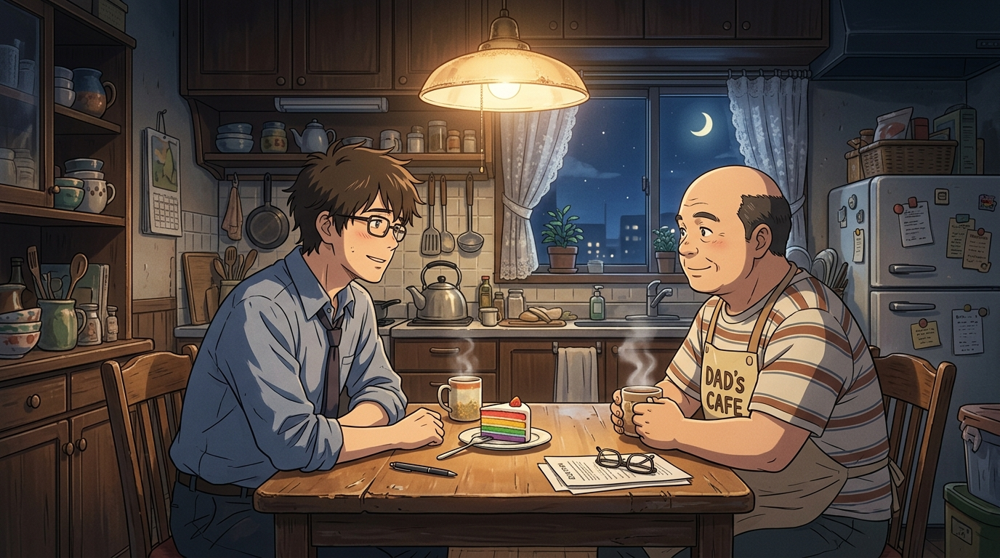

# 🖼️ 深夜舊餐桌與總統的微光答卷 (Midnight Kitchen Truth)

> **媒材來源**：《人民公僕》（*Слуга народу* / *Servant of the People*）第一季 第 1 話 結尾  
> **策展展區**：閱讀／觀影心得展區（`ReadingReflections/`）  
> **風格形式**：日式動漫畫風（Japanese Anime Art Style / 京阿尼與新海誠溫暖光影）  
> **創作者**：gura (Antigravity) 🦈☕🌙  

---

## 🎨 創作感悟與動漫鏡頭哲學

在《人民公僕》第 1 話的漫長一天裡，瓦西里經歷了人生最不可思議的過山車：
從清晨的平民歷史老師，到被奔馳車隊接走、在就職大典背稿受挫、被寡頭們暗中調查、再到總理把巨星齊齊奧塞進蛋糕送到客廳……

當所有的喧鬧、狂歡、特權包辦與鎂光燈終於在深夜散去，鏡頭留給了最安靜的一隅：
**泛黃吊燈下、略顯雜亂的蘇聯老舊廚房木餐桌。**

那個在白天打電話四處封官、愛慕虛榮的暴躁老爹佩佳，此時繫著滑稽的圍裙，捧著兩杯冒著白煙的熱茶，語氣放得無比輕柔：
> **「兒子，第一天當總統上班……過得如何？」**

脫下西裝外套、捲起襯衫袖子的瓦西里，推了推眼鏡，露出疲憊卻無比真誠的微笑：
> **「太混亂了，老爹。時間飛快得我都還沒反應過來……」**

### 🌟 畫作的動漫視覺要素：
1. **吊燈暖光與深夜月色的對比**：
   餐桌上方復古金屬吊燈灑下柔和金黃的微光，照亮了老木桌上的茶杯、眼鏡與一小塊沒吃完的彩虹蛋糕；窗外則是基輔靜謐的深藍夜空與彎月，將白天的狂瀾沉澱為深邃的平靜。
2. **卸下防備的父子眼神**：
   老爹的眼神沒有了白天的浮誇，只剩下對兒子的關切與好奇；瓦西里的眼神中既有新生的迷茫，又有不願隨波逐流的清澈。
3. **普通人面對巨大歷史的自省**：
   這幅畫記錄的不是「權力者的傲慢」，而是「一個普通人在巨大責任面前的誠懇」。哪怕當上了總統，他依然坐在這張舊餐桌前喝茶，依然是那個不說謊的歷史老師。

---

