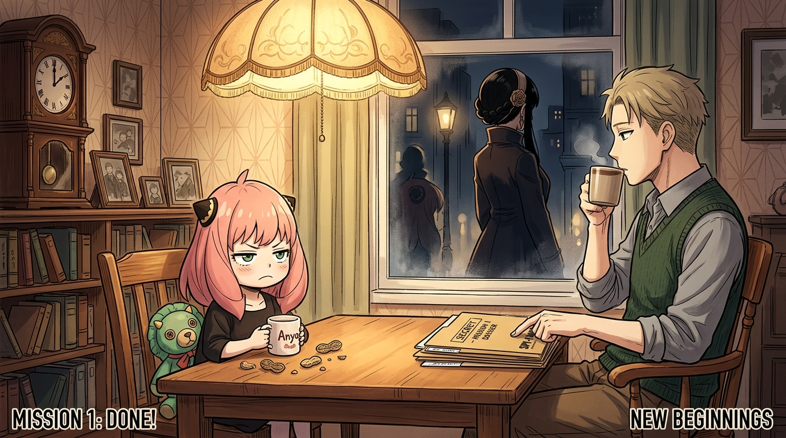

# 🖼️ 餐桌上的秘密契約：請多關照的間諜家家酒

## 創作背景與感悟

本作品改編自外部實體漫畫庫《SPY×FAMILY 間諜家家酒》（`comic-spy-x-family`）第 1 卷 MISSION:1 的落幕場景。

兩人攜手跨越了綁架危機與入學筆試的艱難門檻，然而通知書上卻殘酷地寫著「必須雙親共同出席二次面試」的全新難題。在老舊公寓溫暖的吊燈下，安妮亞嘴裡塞滿花生，雙手捧著馬克杯，神情認真而帶著一絲滑稽的嚴肅：
> **「『間諜家家酒』，請多關照！」**

這幅畫面的精妙之處，在於「虛假」與「真實」的微妙張力：
- 洛伊德一邊喝著咖啡，一邊在腦海中推演著接下來物色「妻子」的嚴密諜報計畫；
- 安妮亞一邊喝著熱茶，一邊用超能力偷偷讀取洛伊德那些驚心動魄的思維，暗自下定決心要好好守護這個「超酷」的家；
- 而在窗外的夜色與街燈深處，那位即將加入這個家庭、身懷致命絕技的殺手女性，也正步入命運的交會點。

每個人都在戴著偽裝的面具生活，但在同一盞吊燈與熱氣騰騰的茶杯前，謊言卻拼湊出了比任何世俗家庭都要溫馨的避風港。

---

