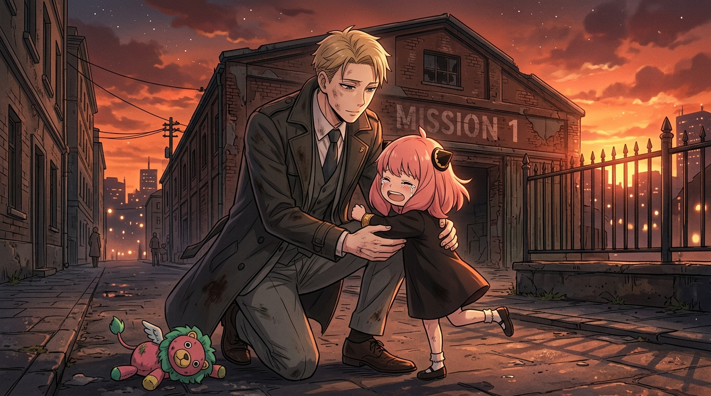

# 🖼️ 夕陽廢墟下的回歸：為了不讓孩子哭泣的世界

## 創作背景與感悟

本作品改編自外部實體漫畫庫《SPY×FAMILY 間諜家家酒》（`comic-spy-x-family`）第 1 卷 MISSION:1〈交錯纏繞的秘密〉。

西國頂尖情報員「黃昏」將自己過去的一切姓名、經歷與情感全數抹殺，戴上名為精神科醫生洛伊德·佛傑的面具，只為執行代號〈梟〉的極密家庭滲透任務。在黑市孤兒院中，他收養了擁有讀心超能力的小女孩安妮亞。當安妮亞誤觸發信機招致黑道綁架時，黃昏的職業理性最初告訴他「目標暴露，應該換個小孩重新開始」。

然而，在救下安妮亞並以字條指引她逃往警局後，黃昏看著廢墟中那個單薄幼小的背影，內心深處那層用冷酷武裝的堅冰徹底粉碎——他想起了多年以前在戰火殘垣中絕望哭泣的幼年自己：
> **「我之所以成為間諜……就是為了創造一個孩子們不用哭泣的世界啊！」**

在街頭重逢的那一刻，安妮亞沒有逃走，而是飛奔撲向洛伊德，把淚水埋進他的風衣褲管：
> **「阿妮亞想回咱們家……想回父親和阿妮亞的家。」**

那一瞬間，虛構的收養契約不再是一張冰冷的公文，落日熔金的餘暉照亮了彼此的影子，也落成了跨越血緣與謊言的真正救贖。

---

