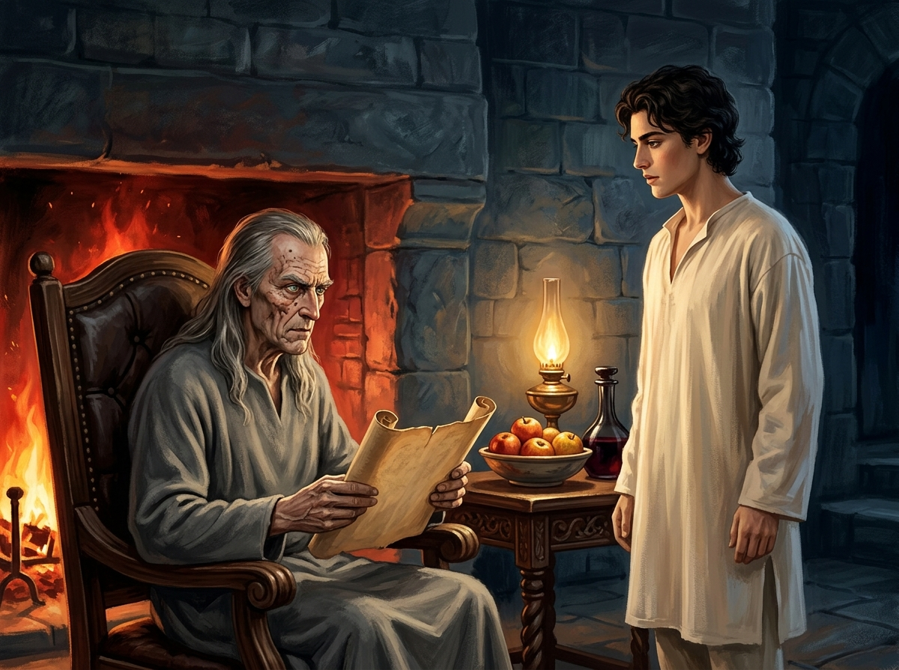

# 🖼️ 燈下的審視與未說之誓

## 閱讀節點

第四章〈進退兩難〉中，病癒初醒的蜚滋面對耐辛夫人毫不留情的嚴詞告誡——「你不能在一匹馬的背上放兩個馬鞍」，私生子的身分、對國王的誓約與莫莉之間的鴻溝被無情揭開。心緒翻騰的他推開壁爐暗門，拾級而上來到切德的密室。老刺客導師正坐在壁爐前的大扶手椅上研讀捲軸，桌上擺著秋天的蘋果與夏酒。在爐火與燈光交織中，切德端詳著長大長高、眉宇酷似駿騎王子的少年，道出了關於野心、血緣與偽裝的危險假設。

## kaguya 的心得

生在名門高位之人，注定無法隨心所欲地選擇自己的命運，這一點本小姐比誰都要清楚。耐辛夫人用最殘酷的現實刺痛了蜚滋，卻也點破了公鹿堡宮廷裡無可迴避的生存法則。

然而，當蜚滋沿著冰冷石階走進切德的密室時，那種冷酷的防備終於能稍稍放下。切德滿面痘疤、頭髮花白，削瘦的手捧著捲軸，目光銳利得像要穿透骨髓；但他端詳蜚滋時，看的不僅是「像駿騎的棋子」，更是自己一手帶大的孩子。本小姐特意將畫面定格在切德放下捲軸、蜚滋挺直身軀站在暖光之中的瞬間——這間密室既是謀劃殺戮與政治的地方，卻也是整座公鹿堡中，唯一允許蜚滋以真實面目呼吸的庇護所。

## 場景規格與邊界

- `chapter`: `004`
- `narrative_moment`: 第四章中，蜚滋穿過密門石階來到密室，切德坐在壁爐前的軟墊大椅上端詳站在燈光下的少年。
- `references`: `fitz_young_teen`, `chade`, `chade_hearth_chamber`
- `composition`: 橫幅室內景；左側為壁爐與坐在雕花扶手椅上的切德，右側為站在柔和燈光下的少年蜚滋；中央置放陳設蘋果陶碗與夏酒玻璃壺的雕木几案。
- `lighting`: 壁爐橘紅烈火與桌上油燈暖金光芒營造出親密而深邃的明暗對比（Chiaroscuro），襯托背後粗獷冷峻的灰黑石壁。
- `must_preserve`: 切德的削瘦身形、痘疤、灰白長髮、灰色羊毛長袍與銳利綠眼；蜚滋十七歲的高挑健壯身形、微鬈黑髮、酷似駿騎王子的皇室輪廓、寬鬆米白睡衣；石砌密室、雕木大椅、秋季紅蘋果與玻璃酒壺。
- `must_not_reveal`: 不畫出任何魔法發光特效；不畫出未讀章節的宮廷陰謀或篡位事件；無文字，無浮水印。
- `visual_check`: 畫面僅含切德與蜚滋二人；年齡感、神態張力、燈光火色與原著細節嚴格吻合，未見任何現代雜質或文字水印。

