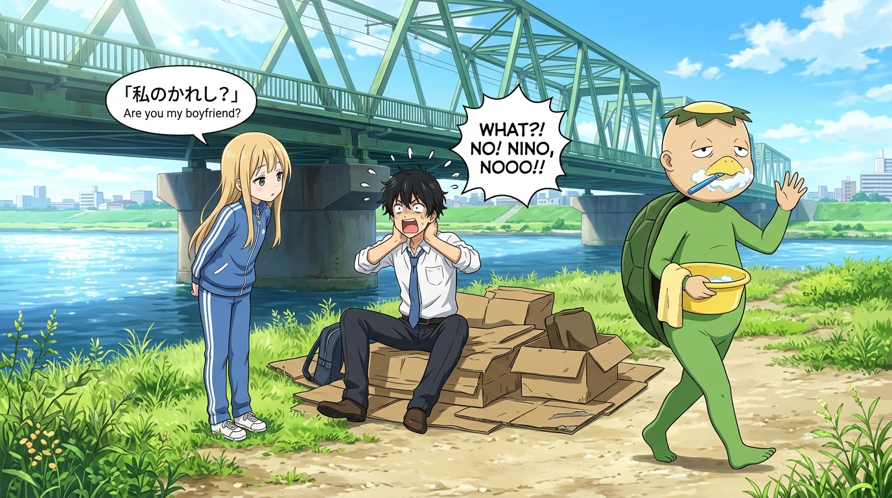

# 荒川清晨的刷牙河童與忘卻之問 (Morning Toothbrushing Kappa and the Question of Oblivion)

## 策展筆記 🐔✨

荒川的早晨，永遠不會按照文明社會的常理出牌！

### 畫面意境
晴空萬里的荒川河床，宏偉的綠色桁架鐵橋橫跨天際。
畫面右側，頭頂黃色塑膠頂盤、身穿綠色橡膠連身衣的河童村長，嘴裡叼著牙刷、嘴角帶著白沫泡沫，悠哉地端著黃色臉盆漫步走過，隨意向新住民打招呼；
而在紙箱床鋪前，金星美少女小珊微微前傾，以極度認真又純真的表情丟出靈魂提問——「你是我的男朋友吧？」；
中間西裝凌亂、領帶歪斜的小招雙手抱著落枕扭傷的脖子，滿臉冷汗與漫畫式崩潰，在荒謬與現實的拉扯中絕望大喊。

### 荒川的哲思提煉
1. **荒誕背後的鬆弛感**：
   在現代都市中，每個人都戴著沉重的精英面具與社交禮儀；但在荒川，哪怕是怪異至極的河童皮套與天然呆的金星發言，都能在晨光中無拘無束地共存。
2. **安息的場所（安息の場所）**：
   這一話的標題名為〈安息的場所〉——看似最不得安息的硬紙板床與落枕，卻是讓心靈徹底卸下「不可欠人」精神壓力的起點。正是這群不按常理出牌的怪人，為小招築起了真正能放下防禦的安息之所。
