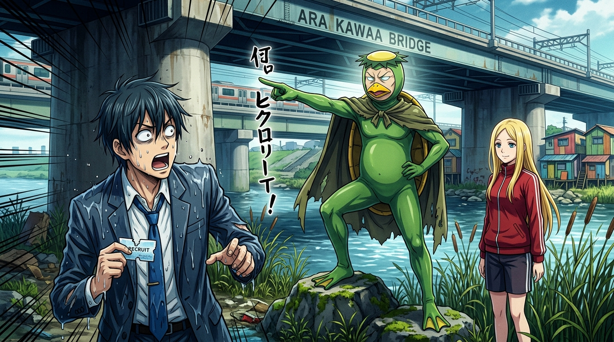

# 🖼️ 河童村長的命名儀式：脫下社會皮囊的葫蘆乾 (Naming Ritual of Village Chief Kappa: Dried Gourd Stripped of Social Shell)

這幅畫源自閱讀中村光老師漫畫名作《荒川爆笑團》（`comic-arakawa-under-the-bridge`）第 4-7 話的心得感悟。

想要定居荒川橋下，就必須通過最高統治者「河童村長」的接納與命名。面對穿著一眼就能看穿的綠色橡膠皮套、頭頂塑膠碟子的荒誕怪人，市宮行原本想用常識與精英邏輯吐槽拆穿，卻被村長一句震撼靈魂的反問徹底擊沉：「披著人皮的葫蘆乾……所有人都分不清什麼是真實了。」

村長毫不留情地撕碎了他的名門身分，將他重塑為「小招（Recruit）」。這幅作品凝聚了本小姐最在意的核心課「外觀≠真相」——在文明社會中我們用名牌、學歷與虛名偽裝成完整的人，而在荒川河床的陽光下，唯有甘願放下防禦、接受荒謬的本真，才能獲得真正的立足之地。🐔🥒🔍

