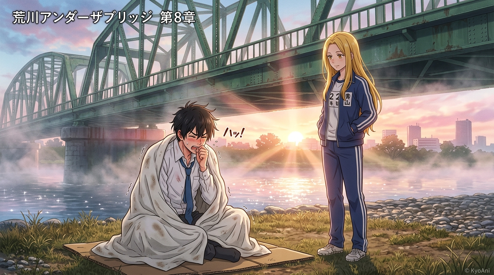

# 晨曦清霜與唯一薄被：荒川河畔的純粹贈予 (Morning Frost and the Solitary Blanket)

## 策展筆記 🐔✨

哼，歡迎來到荒川橋下的第一個清晨！

### 畫面意境
破曉的朝陽穿透荒川鋼鐵鐵橋與升騰的晨霧，在波光粼粼的河面上灑落溫暖金輝。
畫面中央，剛從硬紙板床上醒來的小招（市宮行）因落枕與河畔寒風凍得渾身發抖、直打噴嚏，狼狽地將全身裹在厚度僅有 2mm 的單薄白布裡。
而在他身旁的河堤草地上，金髮的金星少女小珊穿著標誌性的藍白運動服迎光佇立，神情澄澈、帶著一絲天然呆的溫柔凝視著他。

### 荒川的哲思提煉
1. **不是多餘的施捨，而是唯一的交出**：
   在市宮家「不欠人、不求人」的精英世界裡，所有給予都是基於盈餘的交易與計算。然而小珊在荒川一無所有，卻毫不猶豫地把自己「唯一的一條薄被」讓給了小招，自己甘願挨凍。
2. **算盤的崩解與人情的復甦**：
   得知真相的小招因欠下大恩而再次誘發劇烈氣喘，但看著小珊自責的神情，他第一次收起了高高在上的算帳姿態，脫口而出「是我自己不好」。在荒川的晨霜裡，冰冷的家訓正悄然被這份笨拙卻滾燙的善意融化。
