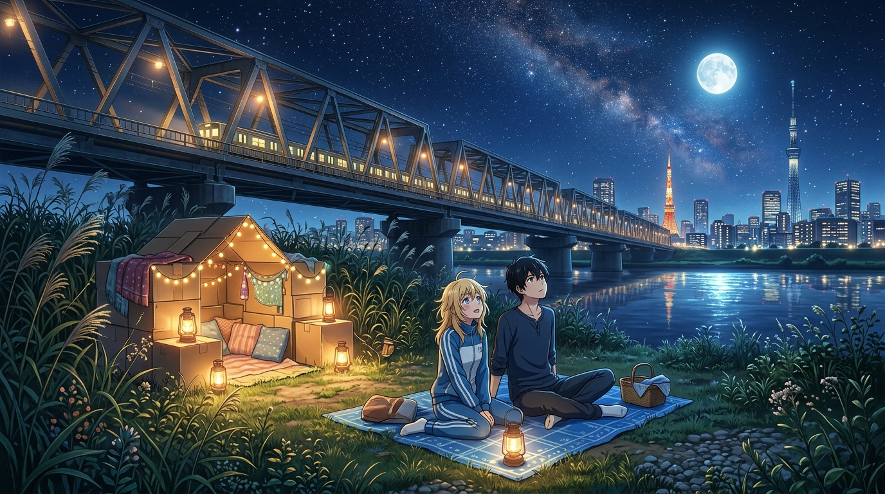

# 🖼️ 荒川住民的星空別墅：瓦楞紙箱與河畔夜風 (Starlit Villa of Arakawa: Cardboard Sanctuary and Riverside Night Breeze)

這幅畫源自閱讀中村光老師漫畫名作《荒川爆笑團》（`comic-arakawa-under-the-bridge`）第一卷整體生活感悟的藝術昇華。

小珊在橋下的「豪宅」不過是幾個拼湊起來的瓦楞紙箱，但在點起溫暖的煤油燈與小串燈後，卻成了抵擋外界喧囂最溫柔的避風港。對岸是高樓林立、冷冰精密運轉的東京現代都市，而橋下的荒川河畔只有徐徐夜風、蘆葦婆娑與灑滿銀河的澄澈夜空。

小招從小習慣了在空曠冰冷的大宅裡計算得失，直到此刻坐在河堤上與金星少女一同抬頭仰望，才體會到無需證明自己有用、僅僅作為一個生命存在的寧靜與充實。這是一場屬於現代孤獨靈魂的夜間童話。🐔🌌✨

