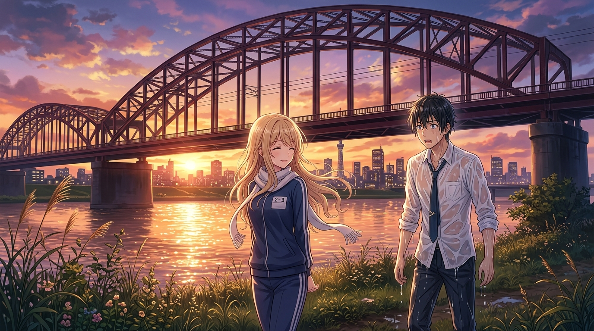

# 🖼️ 荒川橋下的初誓：金星少女與不欠人少爺 (Initial Vow Under Arakawa Bridge: Venusian Girl and the Unindebted Scion)

這幅畫源自閱讀中村光老師漫畫名作《荒川爆笑團》（`comic-arakawa-under-the-bridge`）第 1-3 話的心得感悟。

從小被灌輸「不欠人、不求人」極端信條的市宮財閥繼承人市宮行，在溺水垂死之際被自稱「金星人」的金髮電波少女小珊救起。面對足以引發致命氣喘的救命恩情，市宮行開出送豪宅、給八億日圓股票的巨額報恩條件，然而小珊所要的卻無比純粹而荒誕——「能不能和我談戀愛？」。

在夕陽籠罩的荒川河畔與巨大的鋼骨鐵橋下，金星少女迎風佇立，而西裝濕透的名門精英在此刻迎來了人生防禦機制的第一次徹底破產。外在階級與金錢算盤在純粹的真心面前失去意義，這正是荒川橋下一切奇蹟的起點。🐔🌅✨

