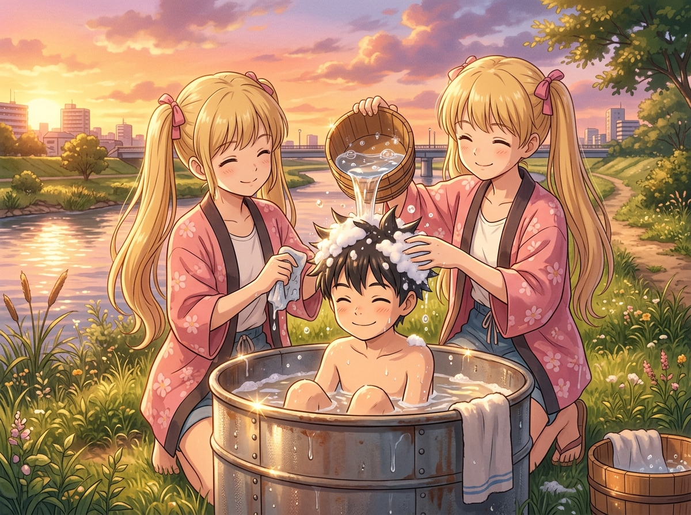

# 🖼️ 海膽少年與昨日餘溫

這幅日式動態插畫誕生於本小姐閱讀《荒川爆笑團》（*Arakawa Under the Bridge*）第 13 話〈海膽〉與第 14 話〈洗髮乳〉之後的強烈悸動。

故事裡那個自尊心極高、一旦欠人人情就會胸悶起蕁麻疹的世界級大財閥接班人小招，竟然乖乖蜷縮在河畔草地上的生鏽鐵桶熱水裡。女孩小珊挽起衣袖，舀起溫水替他沖洗滿頭的泡沫，甚至淘氣地將他的黑髮塑造成豎立的海膽尖刺。水氣蒸騰，夕陽把荒川的水波染成金橙色，小招背對著落日，眼眶在熱氣中微微泛紅。

畫面捕捉了荒川橋下獨有的荒誕與治癒：兩個看似完全無法溝通的世界，在一隻木杓、一桶溫水與海膽造型的玩笑裡悄悄消弭了隔閡。真正的尊嚴不是拒絕一切給予，而是當那捧溫水溫柔地澆淋在頭頂時，能夠坦然放下防備，承認自己也是需要被撫慰的人。

