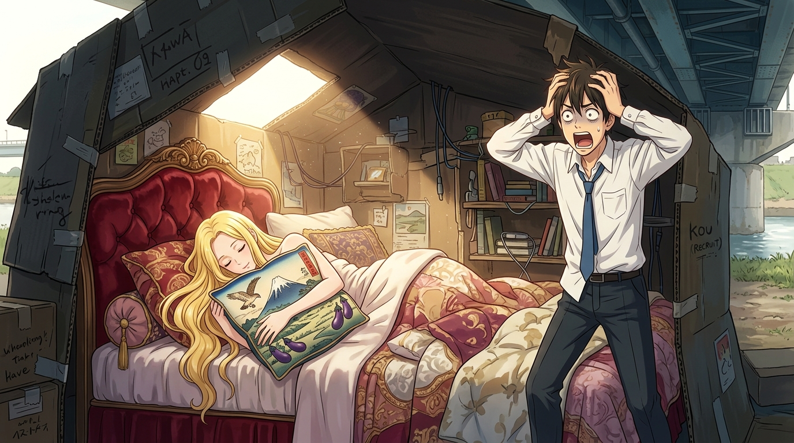

# 希臘國王的天鵝絨天國與富士初夢枕：紙箱裡的奢華倒錯 (The Greek King's Velvet Realm and the Fuji Dream Pillow)

## 策展筆記 🐔✨

荒川的常識，就是專門用來打破常識的！

### 畫面意境
暖金色的晨曦透過紙箱天窗傾瀉而下，將小珊的瓦楞紙小屋照得明亮溫馨。
畫面左側，金髮的金星少女小珊宛如睡美人般，甜美寧靜地深陷在華麗的酒紅色拉扣古典天鵝絨大床上；她懷中緊緊抱著印有浮世繪風格「一富士、二鷹、三茄子」的傳統吉祥禮盒枕頭，嘴角浮現幸福的微笑。
而畫面右側，名門財閥接班人小招雙手抱頭、眼珠外凸，陷入了靈魂被徹底震撼的漫畫式抓狂——他萬萬沒想到，自己以為淒涼悲慘的遊民女友，睡得竟然比自己老家的大床還要奢華！

### 荒川的哲思提煉
1. **價值的倒錯與解構**：
   在市宮少爺的認知中，「橋下紙箱＝苦難貧困」，然而小珊卻在廢棄的紙箱內安放了一張希臘國王級的天鵝絨大床。這種物質形式與精神享受的極致反差，狠狠嘲諷了文明社會以地段與標籤衡量幸福的單一標準。
2. **女朋友的幸福就是你的幸福**：
   小珊一句純真的「我過得很幸福，這不是很好嗎？」，擊碎了小招居高臨下的憐憫與自我感動。荒川不是需要被拯救的廢墟，而是一座自給自足、能將任何漂流物轉化為幸福王國的世外桃源。
