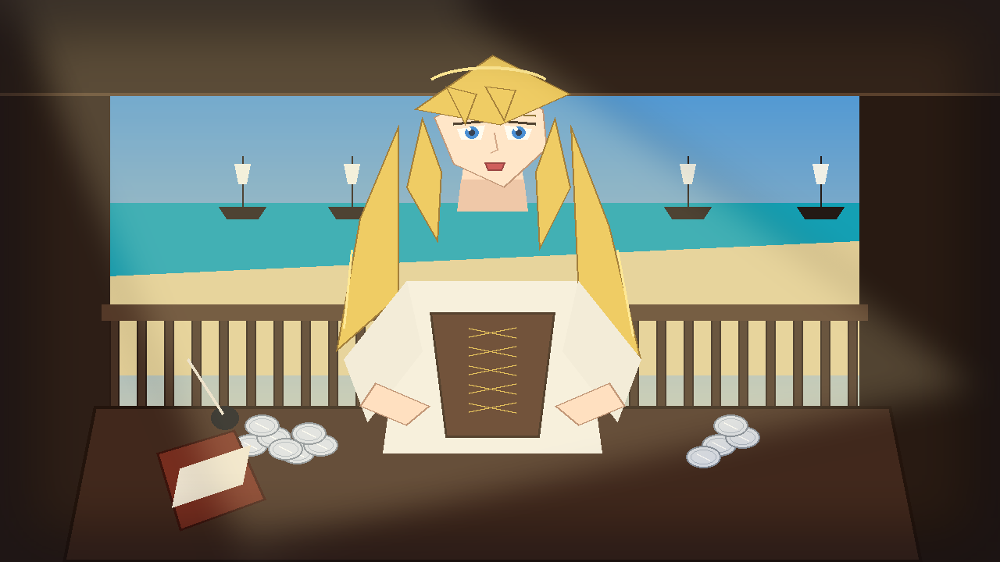

# 🖼️ 拿騷女王的黑市鐵腕 (Eleanor Guthrie: Sovereign of Nassau)

## 創作感悟與理念

本作靈感源自《黑帆》（`series-black-sails`）第一季第 1 話中艾莉諾·加斯里（Eleanor Guthrie）霸氣登場的震撼場面。

在拿騷這個由無數窮凶極惡的海盜、逃犯與亡命之徒構成的男性野蠻世界裡，年輕的艾莉諾憑藉對走私銷售與洗錢通路的絕對壟斷，掌握了所有海盜船長的生死命脈。當懦弱船長因皇家海軍逼近而退縮時，她毫不留情地爆粗驅逐；當大副蓋茨前來借款時，她一句「但他最近沒有替我賺錢」道盡了資本的殘酷底色，更以「我父親不在這裡真是一件好事」展現出架空親父、獨立建立拿騷王國的梟雄野心。

畫面以明媚的加勒比碧海藍天與殖民風格陽台為背景，金髮在熱帶海風中優雅飄揚。艾莉諾端坐於擺滿帳本、羽毛筆與閃爍「八里爾銀幣」的紅木大桌前，以銳利冷豔的深藍眼眸注視著前方，展現出真正的島嶼統治者風範。

